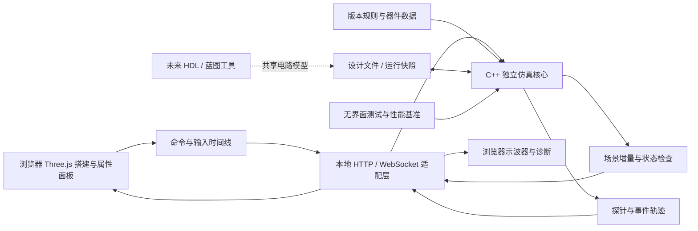

# VeriMC 模块一：红石搭建、独立仿真与调试

**状态：v0.3 已获准实施；C++ + 浏览器界面，子项目 simulator。**  
**日期：2026-09-06。**  
用户已批准开始实施；所有实现位于 `simulator/`。本文描述目标架构和验收要求，实际完成范围与测试证据见 `simulator/docs/implementationStatus.md`；性能目标不代表已测结果。

**本次已确认：** 内核使用 C++；TNT 复制机、流体农场、矿车计算机及依赖生物 AI 的机器暂不做。  
**本次调整：** 界面改为浏览器 + Three.js，取消 Qt 桌面方案。推荐首版保留本机原生 C++ 仿真，以本地 HTTP/WebSocket 接入浏览器；纯 WebAssembly 路线作为备选，区别见第 5.4 节。

## 1. 提议与需要审阅的决定

模块一交付一个在浏览器中操作的本地电路工作台：你可以在三维空间中亲手放置 Minecraft 方块、连红石、操作器件、运行仿真，并用示波器观察每一次信号变化。日常运行不启动 Minecraft。

建议采用 **C++20 原生仿真内核 + 本地服务 + TypeScript/Three.js 浏览器编辑器 + Canvas 示波器**。C++ 用 CMake 构建，前端在开发时构建成静态资源。内核以真实方块机制为基础，用事件调度、紧凑数据和局部更新提高速度。HDL 编译器与蓝图导出以后接入同一个电路数据模型。

核心使用 C++ 已由你确定；浏览器 + Three.js 是你提出的界面方向。**本稿建议启动一个本地 C++ 程序，再由它自动打开浏览器页面**：计算在本机原生进程中执行，浏览器负责交互和显示。本稿不承诺免安装，也不要求远程服务器；界面静态资源随程序提供，安装后可离线使用。

选择 Three.js 可以利用现成的三维场景、相机与实例化能力，减少界面和视口的维护负担。原生仿真仍然便于你用 C++ 调试。这个选择增加了本地通信和重连处理的工作，相关约束列在第 8.2 节；性能仍需实测。[Three.js：InstancedMesh](https://threejs.org/docs/pages/InstancedMesh.html)

| 决定 | 当前方案 | 状态/影响 |
|---|---|---|
| 内核语言 | C++；建议标准版本 C++20 | C++ 已确认；标准版本属于实现建议 |
| 世界边界 | 暂不做 TNT 复制机、流体农场、矿车计算机、生物 AI 机器 | 已确认；内生模拟电路、活塞与容器，复杂自然环境使用输入/输出接口 |
| 兼容版本 | Java Edition 26.2 正式版；默认不启用实验性规则 | 沿用原稿默认目标，待随整体方案确认 |
| 产品形式 | 浏览器编辑器 + 本地原生 C++ 程序，平台优先级见第 14 节 | 本次推荐；纯浏览器内 WebAssembly 执行单独比较，不与浏览器界面混为一项 |
| 精度与速度 | 一个以原版行为为目标的执行模式；通过验证的优化透明启用 | 保留精确时序目标，不因语言改变而降低精度或宣称自然提速 |
| 器件范围 | 第 4 节列出的红石器件及必要支撑方块均进入模块一 | 保留完整器件目标；环境行为分级声明 |

这一范围允许把精力集中在红石计算机所需的门电路、时钟、存储、总线、计数器和运算部件上。活塞、漏斗和容器仍然在范围内；复杂机器的排除不等于其组成器件全部被删除。

## 2. 版本依据与兼容环境

### 2.1 已核实与仍需核实的内容

官方已经发布 Java Edition 26.2。本项目将用户指定的 **26.2** 当作固定目标，未来即使出现新版本也不自动改变旧工程规则。[Minecraft 26.2 正式发布说明](https://www.minecraft.net/en-us/article/minecraft-java-edition-26-2)

器件盘点不能停留在旧版常用红石列表。例如铜箱、红石控制的置物架、可供比较器读取的铜傀儡雕像、避雷针氧化变体，均需要进入目标版本核查表。[Minecraft 1.21.9 正式发布说明](https://www.minecraft.net/en-us/article/minecraft-java-edition-1-21-9)

26.2 还增加了与红石有关的环境交互：间歇泉的喷发事件可被幽匿感测器检测；硫磺怪与发射器、红石引燃 TNT 有交互；新唱片也有比较器输出。这些内容分别进入环境刺激、发射器行为分支和唱片数据覆盖表。[Minecraft 26.2 正式发布说明](https://www.minecraft.net/en-us/article/minecraft-java-edition-26-2)

**发布说明不等于完整仿真规范。** 本轮没有运行参考游戏、读取目标构建的全部器件实现或完成逐器件差分测试。因此本文不宣称已经核实每一个延迟、更新顺序或特殊行为。

批准后的第一阶段需要固定一份兼容清单，至少包含：

- edition、version、参考发行构建的下载来源与校验值、游戏数据版本。
- 方块 ID、合法状态、方块实体字段、物品堆叠与配方数据、相关标签。
- 维度、坐标范围、加载区块与处理顺序、世界种子及实际随机源状态。
- 游戏规则、实验开关、天气/时间、随机刻模式、更新限制。
- 测试适配器与追踪器版本；测试初始状态和放置/操作时间线。

语义证据优先级：**固定构建的实测与运行逻辑 → 官方说明 → 有来源的待验证假设**。证据冲突时保存最小复现，不用“大家都这么记”决定。

### 2.2 默认电路实验环境

- 有限三维工作区域，区域内区块常驻加载；外部边界条件明确为无器件空间，越界交互显式报告。
- 坐标和方向沿用 Java Edition；构建高度与世界坐标限制从目标版本读取。
- 默认采用固定天气、固定日照输入、关闭自然随机刻的实验条件；这些是**实验环境设置**，不是声称原版默认如此。
- 对照 Minecraft 时配置相同环境。若开启原版随机刻，应按实际算法、抽样位置、调用顺序处理；不能给每个方块随便抽一个随机延迟。
- 首版不模拟区块加载器、卸载恢复、跨维度机器与加载边缘行为。工程依赖这些条件时不能显示“已验证兼容”。
- 仿真使用游戏时间，20 game ticks（gt）对应标准运行速度的一秒；通常所说的 1 redstone tick（rt）按 2 gt 显示。加速改变墙钟耗时，不缩短器件在游戏时间里的延迟。

## 3. 用户如何使用

### 3.1 搭建工作台

界面采用四个可调整区域：左侧器件库、中央三维工作区、右侧属性与检查器、底部示波器；顶部放置工程与运行控制。

本稿建议默认使用围绕电路旋转/平移镜头、正交视图和逐层搭建的工程编辑方式，兼顾自由飞行观察。是否把 Minecraft 式第一人称搭建也列为首版必须功能，留给第 14 节决定。

首版必须支持：

1. 新建、保存、打开工程；自动恢复最近的未保存设计。
2. 放置、删除、吸取方块；显示预览、朝向和放置合法性。
3. 器件属性编辑：朝向、附着面、中继器档位、比较器模式、容器内容等；运行派生状态以只读方式显示。
4. 框选、复制、粘贴、移动、旋转、镜像、填充、撤销与重做。
5. 自由观察、正交俯视/侧视、网格吸附、指定高度工作平面、逐层剖切和局部透明。
6. 坐标显示与跳转、器件搜索、名称标注、区域分组、可复用方块组合。
7. 拉杆拨动、按钮点击、容器交互等运行操作；输入可记录成重复执行的时间线。
8. 红石强度着色、方向箭头、连接形状、通电状态、活塞位移的可视化。

视觉风格以方块识别、方向辨认和密集电路可读性为先；复杂光照、粒子和生物动画不进入性能关键路径。

### 3.1.1 启动与保存体验

安装/解压对应系统的 VeriMC 后，启动一次本地程序，自动打开浏览器中的工作台。浏览器关闭后程序可从连接状态判断是否暂停，重新打开页面可恢复工程；界面提供明确的退出本地程序入口。

前端随本地程序发布，不依赖线上 CDN。普通使用者无需安装 Node.js、CMake 或 C++ 编译器；这些只在开发/构建环境使用。开发阶段前端热更新服务也不是最终用户必须运行的服务。

工程保存由本地程序管理项目目录，前端通过工程 ID 操作；首版提供通用的浏览器文件选择导入和下载导出，不把某个浏览器专用的文件系统 API 作为必需依赖。自动恢复写入本地项目存储，不能仅靠标签页内存。

### 3.2 编辑状态与运行状态分开

- **设计状态**保存你搭建的初始电路；**运行状态**包含当前信号、移动中的方块、容器变化与待执行事件。
- 点击“从设计运行”创建一次明确的运行实例。装载过程使用记录的初始化策略，不能假设任意电路都会自行稳定。
- 默认修改结构时先暂停。编辑事务在安全边界按确定顺序提交，逐项执行该操作应有的原版更新；“一次撤销”不代表可以把原版多次可观察更新压成一次。
- 即时操作也有确切时间戳；高速运行时显示实际接收该操作的 gt，避免暗示鼠标点击恰好发生在墙钟对应的某一刻。
- 撤销设计不等于逆转一次仿真。运行回退通过检查点和输入重放完成。
- 可把当前静止结构另存为设计；若仍有移动方块或未决状态，明确给出限制。精确续跑需保存运行快照。
- 对依赖搭建顺序、BUD 状态或初始化脉冲的电路，保存放置历史或精确初始快照，不能只保存最终方块布局。

### 3.3 运行控制

支持暂停/继续、重置、1 gt 单步、1 rt 单步、下一事件、运行 N gt、运行到指定时间、运行到触发条件。提供标准 20 gt/s、可选倍率与“尽快运行”。

事件单步展示同一 gt 内的内部执行顺序，**不把内部顺序编号伪装成 Minecraft 中存在的物理时间单位**。运行配额耗尽时保留现场并暂停；可恢复，不删除剩余事件。

## 4. 器件范围与完成定义

### 4.1 不能用一个“支持”标签概括全部行为

每个方块 ID 的每个行为面分别记录：

- **原生目标**：本模块应在内核中自行完成的机制，验收时必须有差分或明确规格证据。
- **刺激驱动目标**：外部条件由测试环境提供，器件对该条件的响应由内核计算。界面注明条件来源。
- **范围外**：本稿未承诺的机制；相关操作应拒绝或报告停止原因。
- **待验证/待实现/已验证**：实现进度标签，独立于上面三种范围。当前所有器件均尚未实现。

例如压力板的实体类型、数量、进入/离开时序和输出计算应由模型处理，测试环境可以提供实体接触轨迹；不能直接把它的输出设成任意电平后宣称实现了压力板。

### 4.2 核心电路与运动器件：模块一原生目标

| 类别 | 必须纳入的器件/方块族 | 必须实现的行为面 |
|---|---|---|
| 传输与支撑 | 红石粉、完整支撑方块、玻璃、台阶、楼梯、萤石、目标方块等特殊连接/支撑材料 | 0–15 强度、实际连接形状、上下台阶、导电/不导电、强弱充能、附着与形状更新 |
| 恒定与手动输入 | 红石块、拉杆、各行为不同的按钮、压力板与轻/重质测重压力板 | 输出方向、通电/松开、持续时间、实体过滤与权重；实体接触来自测试环境 |
| 延迟与逻辑 | 红石火把及墙上形态、中继器、比较器 | 火把反相/熄灭/恢复、中继器延迟与锁定、比较/减法、模拟量读取、更新优先级 |
| 状态检测 | 侦测器、目标方块 | 被观察状态的判定、排程与脉冲、目标命中位置相关输出；弹道命中由刺激驱动 |
| 输出与存储 | 红石灯、铜灯全部相关变体 | 点亮/熄灭时序、铜灯状态保持、边沿响应、比较器可读状态 |
| 活塞系统 | 活塞、黏性活塞、活塞头、移动中的活塞方块 | 推/拉规则与上限、准连接、方块事件、短脉冲、吐块、移动过程、中途更新 |
| 黏连与运动材料 | 黏液块、蜂蜜块、黑曜石及其他必要不可推动/易碎材料 | 黏连分组、互不黏连例外、推动反应、碰撞与支撑变化；具体规则按 26.2 核查 |
| 机械开关 | 各材质门、活板门、栅栏门 | 手动与红石操作差异、上下半结构、开关状态、邻居更新、产生的游戏事件 |
| 声音与事件输出 | 音符盒、钟、相关发声/交互方块 | 触发和状态变化、影响感测器的事件；声音播放属于 UI 附加效果 |

上述“等”用于提示行为盘点，不能作为漏项理由。批准后逐个 block ID 展开，保留材质/氧化/涂蜡等原始身份；只有机制确实相同时才共享实现。

### 4.3 容器、比较器来源与自动处理：模块一原生目标

| 类别 | 覆盖对象 | 边界 |
|---|---|---|
| 通用容器 | 箱子、陷阱箱、铜箱、木桶、潜影盒；其他具有相关读取行为的容器 | 真实槽位、物品数量/堆叠上限、开箱刺激、双箱行为、比较器读取，不能只保存填充百分比 |
| 转移与投放 | 漏斗、投掷器、发射器 | 转移次序、冷却、锁定、面向、选择物品、触发/排程和库存变化；外部作用按下表进一步分级 |
| 加工 | 熔炉、高炉、烟熏炉、酿造台、合成器 | 内部槽位、配方、燃料/进度、漏斗交互、槽位禁用和红石触发；目标版本数据驱动 |
| 特殊读数 | 堆肥桶、炼药锅、蛋糕、讲台、唱片机、雕纹书架、蜂巢/蜂箱、重生锚、铜傀儡雕像 | 对真实离散状态/库存/姿态的读取和状态变化；自然补充由环境刺激提供 |
| 玩家交互 | 置物架、讲台翻页、书架存取、物品展示框/荧光展示框等 | 物品展示框是实体，不能遗漏；交互状态及比较器读取分支按实际构建逐项核实 |

所有比较器读取来源需从 26.2 数据与行为实现审计，不能假设上表已经穷举。配方处理以原版内置数据为范围，自定义数据包后续扩展。

发射器必须建立按物品类别划分的行为表：默认物品投放、弹射物、桶、打火石、骨粉、剪刀、装备、船/矿车、硫磺怪相关交互等。每个分支分别标记目标范围和进度。

原生支持库存选择、冷却和对已建模方块/库存的作用；涉及未建模实体、流体或世界效果时输出包含上下文的环境动作。若后续电路依赖其反馈但未提供环境模型/刺激，暂停并指出缺口。**“发射器被激活了”不足以通过完整发射器验收。**

### 4.4 感测与环境接口：明确的刺激驱动目标

| 对象 | 内核负责 | 环境提供/首版不内生模拟的部分 |
|---|---|---|
| 阳光探测器 | 按输入环境计算输出、反相模式和更新时机 | 天空/光照与天气条件；不实现完整光照传播世界 |
| 绊线钩与线 | 连接、有效性、触发、断线时序和输出 | 实体接触轨迹 |
| 幽匿感测器、校频幽匿感测器 | 事件筛选、传播延迟、范围、冷却、信号/频率、遮挡与紫水晶共振 | 外部生物/世界事件；已建模电路产生的门、音符盒等事件自动送入系统 |
| 羊毛与紫水晶等 | 对振动的隔绝或共振属性 | 不用普通不透明方块属性代替这些专用规则 |
| 避雷针各变体 | 雷击响应与输出时序 | 指定位置/时间的雷击刺激；自然天气不闭环 |
| 铁轨、动力铁轨、探测铁轨、激活铁轨 | 连接形状、供电传播、检测输出和激活接口 | 矿车类型、接触、库存输入；完整矿车运动和碰撞不在首版 |
| TNT | 通电引燃与状态转移，导出引燃事件 | 引燃后的实体弹道、爆炸破坏、连锁爆炸、TNT 复制机器完整闭环 |
| 26.2 新环境 | 发射器/硫磺怪交互接口、间歇泉事件输入、新唱片读数数据 | 硫磺怪物理、喷泉流体和自然喷发过程 |
| 生长与随机变化 | 接收明确的方块状态变更，并执行原版应有更新 | 植物生长、树木生成、自然氧化、蜂蜜产生等过程；可按记录注入 |

区分两条输入路径：**内部设备自然产生的游戏事件**和**测试人员提供的外部刺激**。二者都经过器件规则；不绕过机制直接写输出。能否根据当前事件刺激未来环境，必须显式连接并在工程内保存。

环境刺激首先通过可操作面板提供：设定接触压力板的实体类型/数量与进入离开时间、设置光照条件、发送指定位置的振动、指定目标命中等，并能保存到时间线。常用调试不要求你编写脚本。接口仅描述输入与输出，不发展成另一套生物、流体或矿车模拟器。

### 4.5 方块闭包与明确排除

“只做红石相关方块”依然需要一组支撑方块，因为支撑、导电、碰撞、可推动性、振动隔绝和观察者检测本身就会影响电路。采用数据驱动的行为属性，复用普通方块实现，避免为每种石头写一套代码。

属性至少区分：面支撑、导电判定、碰撞形状、红石连接、推动反应、黏连、比较器读取、振动属性、方块实体与状态更新。**不把所有透明方块、所有不透明方块分别视为同一种红石材料。**

用户已明确排除 TNT 复制机、流体农场、矿车计算机和依赖生物 AI 的机器。对应的完整流体、爆炸、矿车动力学和生物 AI 不进入当前实现计划，也不作为模块一未完成的待办。

命令方块、结构方块、拼图方块、测试/调试方块，以及以命令执行改变世界的机制不属于生存红石硬件模型；不会执行任意 Minecraft 指令。完整掉落方块物理、战斗、区块装卸、跨维度和模组方块也不在本稿首版范围。TNT 引燃、铁轨供电和检测接口等仍按第 4.4 节保留器件层面的有限能力，不称为完整机器兼容。

选用会依赖范围外行为的工程时，显示具体依赖；禁止将未知 block ID 映射为空气。Create 在未来首先是导出目标，不代表模块一模拟其动力网络。

## 5. 系统结构



### 5.1 技术选择

| 层 | 建议实现 | 原因 |
|---|---|---|
| 核心世界、规则、调度 | C++20 原生库 | 控制内存布局与分配，支持无界面运行；便于你用 C++ 直接维护 |
| 本地服务与启动器 | C++ 可执行程序；HTTP 静态资源和 WebSocket 适配层 | 提供页面、连接仿真核心和管理工程；只监听本机回环地址 |
| 浏览器界面 | TypeScript + React；HTML/CSS 面板布局 | 组织器件库、属性、工具栏和可调整面板；React 不参与逐方块仿真/逐帧场景更新 |
| 三维显示 | Three.js，首版以 WebGL2 渲染路径为基准 | 分区网格、实例化器件、强度属性缓冲和局部上传；不为每个方块创建独立场景对象 |
| 波形显示 | Canvas 2D；按实际瓶颈再加 GPU 路径 | 只绘制可见区和聚合后的边沿，触发判定保留在 C++ |
| 前端后台工作 | Web Worker | 处理二进制批次、网格构建和波形索引，减少主线程停顿 |
| 构建 | CMake + Presets 构建 C++；Vite 构建前端静态资源 | 开发时使用 Node.js，发布时提供已构建资源；不捆绑完整浏览器 |
| 测试与基准 | CTest + GoogleTest；Google Benchmark 和独立场景运行器 | 单元/差分测试与性能测量分开；整电路吞吐不由微基准替代 |

Three.js 提供 WebGL 渲染器和实例化网格，后者可降低重复几何的绘制调用数；具体场景规模、上传量和浏览器内存仍要验证。WebGPU 可在后续有收益时采用，首版不以它作为必要条件。[Three.js：WebGLRenderer](https://threejs.org/docs/pages/WebGLRenderer.html)、[Three.js：InstancedMesh](https://threejs.org/docs/pages/InstancedMesh.html)

构建配置使用项目共享 Presets；测试采用 C++ 测试框架和独立微基准工具。正式验收还需整电路场景测量。[CMake Presets](https://cmake.org/cmake/help/latest/manual/cmake-presets.7.html)、[GoogleTest](https://google.github.io/googletest/)、[Google Benchmark](https://google.github.io/benchmark/)

前端可通过构建工具生成静态资源，随程序嵌入或放在只读资源目录；发布体积以 C++ 程序、所需库和资源的实测结果为准，不提前承诺某个大小。[Vite：Building for Production](https://vite.dev/guide/build.html)

仿真与工程库不包含界面、网络库或 GPU 类型。本地服务进程直接链接核心，由专用仿真线程执行；CLI 链接相同核心，可完全关闭网络和界面。浏览器与本地服务间传输存在序列化、复制和调度成本，应分别测量，不能称为零开销。

### 5.2 核心数据布局

- **稀疏分区世界**：以 16×16×16 存储分区为候选，分区内使用紧凑状态索引；空区不分配。存储分区不能改变 Minecraft 的调度区块语义。
- **状态与行为分离**：方块状态用内部整数 ID；类型和属性表只保存一次。内部 ID 可变，磁盘使用稳定方块名与属性。
- **热状态连续存储**：将常访问的强度、标志、定时状态与依赖索引放入连续数组；容器等稀疏复杂状态独立存储。
- **有序依赖索引**：缓存邻接、潜在准连接、比较器读取与振动订阅关系，保留触发顺序。不要只建立“信号直接连到谁”的图。
- **世代编号**：用于识别位置/对象变化和缓存失效；不能用统一世代规则擅自删除原版在同一坐标仍应执行的计划刻。
- **动态拓扑**：活塞、放置/拆除、门与连接形状改变都会使关联索引失效；重建依赖闭包，不只更新一个固定半径。

禁止每个游戏刻逐一调用整个世界所有方块。必须逐刻工作的活跃容器/运动对象维护有序列表；纯静态方块没有周期性计算成本。

### 5.3 C++ 实现约定与可维护性

采用容易阅读的 C++20 子集：明确的类和函数、RAII、标准容器、固定宽度整数、枚举、视图与显式所有权。核心器件逻辑按类别分文件，避免模板元编程框架或深层继承树。

| 对象 | 建议表示/职责 |
|---|---|
| 方块身份 | `BlockPos`、`BlockStateId` 与独立的属性表；位置与实例身份不混用 |
| 世界 | `World` 管理分区、状态数组和稀疏方块实体；使用稳定索引定位 |
| 调度 | `Scheduler` 管理不同事件容器、阶段和重入上下文；不会为每个事件创建线程 |
| 执行 | `Simulator` 接收命令、按预算推进、产生状态与探针批次；只有它修改运行世界 |
| 记录 | `ProbeRecorder`、输入日志和检查点；按需记录，明确占用预算 |
| 服务边界 | `CommandBatch` 与不可变的 `StateDelta` / `TraceChunk`；服务层编码传输，不把核心世界对象暴露给浏览器 |

热路径使用预分配连续缓冲、按索引访问和必要的空闲槽复用；有测量依据时再引入专用内存池。避免每个方块一个 `new` 或一个多态对象。`std::vector` 扩容和位置删除可能使引用失效，缓存保存句柄而不是长期裸指针；世代检查用于捕获失效访问。

单世界仿真线程拥有可变状态，服务层只读取已经发布的批次。资源默认单一所有权；仅在需要跨线程保留不可变快照时共享所有权。锁定短小的队列操作，不在网络线程持锁遍历世界；先采用可验证的同步方式，再决定是否需要无锁队列。

**Java 到 C++ 的语义差异要显式编码。** 包括整数位宽与溢出、带符号移位、负坐标的 floor 除法与取模、随机算法及调用次序，以及原版依赖的容器迭代行为。不可用 C++ 有符号溢出或 `unordered_map` 的偶然顺序复现原版。枚举事件顺序明确保存，不能通过平台相关内存布局推导。

调试与持续验证启用编译告警、断言、AddressSanitizer/UndefinedBehaviorSanitizer，并在支持的平台使用 ThreadSanitizer 检查共享状态；这些构建与 Release 性能测量分开。序列化按字段和固定字节序编码，不直接把 C++ 结构体内存写入文件。

提供可单独构建的 `simulatorModel`、`simulatorCore`、`simulatorCli`、`simulatorServer` 目标；前端独立构建后打包进发行物。本地 HTTP/WebSocket 使用成熟库作为适配层，具体库在 S0 按平台、依赖体积和维护情况固定。首版不额外建立插件 ABI、通用 ECS 或脚本运行时。新增器件应能沿“状态定义 → 器件处理函数 → 参考样例”的路径完成。

### 5.4 C++ 接入浏览器的两条路线

| 对比项 | 本地原生 C++ + 浏览器（首版推荐） | C++ 编译为 WebAssembly + Worker |
|---|---|---|
| 使用方式 | 先启动本地程序，再自动打开页面 | 加载网页后在浏览器中执行核心；有利于免安装分发 |
| C++ 代码 | 直接编译成本机程序，常规调试与剖析 | 同一核心通过 Emscripten 编译，需处理浏览器运行环境 |
| 数据传递 | 本地通信成本；适合订阅、批量与限流 | 与浏览器 Worker 的缓冲交接；不需要原生服务的回环通信 |
| 内存与文件 | 使用本机进程内存和本地项目目录 | 受目标浏览器、WASM 内存与持久化接口约束，需要单独验证 |
| 执行生命周期 | 浏览器帧率不决定仿真进度；服务可管理续跑 | 页面/Worker 生命周期和后台调度需要处理 |
| 性能判断 | 首版优先固定的基准后端 | 可能适合本项目，不能未经测试认定一定慢或与原生一样快 |
| 首版工作量 | 需要本地服务、发行物及连接恢复 | 需要 Emscripten 构建、浏览器执行/存储适配和新一套运行环境验证 |

Emscripten 支持将 C/C++ 构建为 WebAssembly。将单线程核心放在普通 Worker 中，与启用 pthreads 是两种不同方案；只有选择共享内存/pthreads 等能力时，才应加入相应的跨源隔离与同步约束，不能说所有 WASM 都要求多线程配置。[Emscripten：Building to WebAssembly](https://emscripten.org/docs/compiling/WebAssembly.html)、[Pthreads support](https://emscripten.org/docs/porting/pthreads.html)

**本稿推荐原生后端，是为了先稳定高性能仿真与常规 C++ 调试流程。** 若你的首要诉求是“别人打开网页就能用，完全不运行本地程序”，应选择右侧路线并调整首版验收环境。当前只实现一条路线，另一条保留核心可移植性即可。

## 6. 准确执行与高效调度

### 6.1 时间与事件模型

内部至少分清邻居通知、形状更新、计划方块刻、方块事件、方块实体处理、实体/环境事件、编辑/玩家输入。它们的阶段、重入、去重和排程规则不同。

计划刻可使用包含到期时间、原版优先级、原版子顺序的记录；同刻同步更新需要能保存调用栈/工作列表的执行器。事件还记录目标坐标、预期方块类型、来源和诊断序号。

**不把所有事件统一按“时间、坐标、插入次序”排序。** 也不预设“先更新全部红石粉，再更新全部活塞”的自创阶段。跨区块收集、计划刻选择、方块事件轮次、同步嵌套更新及相应上限都要以 26.2 为依据。

暂停点保留执行阶段和未完成工作。调试器的单步必须继续同一执行过程，不能通过重新扫描世界补算。

### 6.2 红石粉与模拟量

红石粉是多输入、0–15 强度、几何连接和更新通知的组合，不能只是零延迟导线或布尔 OR。

首个正确实现保留目标版本的传播与通知序列。优化从预计算有序邻接、避免重复查表、紧凑队列及快速强度读取开始。

“把整片红石粉一次求出稳态”只允许在已证明等价的区域中启用：证明应覆盖所有外围可观察更新、同刻短暂状态、随机调用和未来队列。侦测器、活塞、比较器、BUD、未定更新或拓扑变化存在时，默认退回标准路径。

同理，相同的邻居更新到达两次不一定可合并；去重只能用于原版本来去重或不改变任何可观察行为的情况。验证不足时保留较慢路径。

### 6.3 准连接、活塞与放置历史

- 准连接需要区分“此位置满足被激活条件”和“此时是否收到能触发检查的更新”。不把它建模成一条永远即时传播的隐藏电线。
- 活塞位移影响真实方块拓扑；需保留移动中的状态、头部、黏连结构和分阶段事件。动画是仿真结果的显示。
- 短脉冲、吐块、BUD、电路朝向与位置相关性采用专门样例验证。
- 旋转、镜像、平移只保证正确变换布局与器件朝向，不保证电路输出不变。原版存在的方向/位置差异应在新位置重新仿真，而不是被优化抹去。
- 同一最终布局若初始化顺序不同，允许产生不同结果；工程记录的初始化方法应足够重放。

### 6.4 不活跃时跳过时间

只有能够证明跳过区间没有有效处理时，才直接前进到下一事件。候选原因包括队列为空、无逐刻对象、没有自然随机刻、没有环境输入、没有要求逐刻采样的探针。

漏斗、加工进度等可以转成唤醒事件，但需证明中间各刻的对外结果、唤醒/锁定、同刻先后和随机源状态等价。否则保留其原版周期处理。

不能因为没有输出变化就认为没有计算意义；也不能把空闲跳跃产生的巨大虚拟 TPS 宣传成活跃电路吞吐。

### 6.5 并发与响应

一个世界由一个仿真线程拥有，内部执行次序明确。首版不为同一片红石网络做并发更新。

可独立运行的工作包括不同测试世界、几何构建、波形压缩与文件写入。UI 发送命令批次，内核按安全边界接收；状态通过有限容量通道返回。

本地网络线程接收命令、发送批次；仿真线程使用 C++ 标准线程承载，不依赖网络轮询或浏览器定时器。前端由 Worker 处理解码/网格工作，主线程负责界面和首版 Three.js 渲染；使用可转移缓冲交接大块数据，转交后原持有方不再访问该缓冲。[MDN：Using Web Workers](https://developer.mozilla.org/en-US/docs/Web/API/Web_Workers_API/Using_web_workers)

每次工作批次设置墙钟预算与事件数预算。遇到巨大更新链时允许保存执行器状态并让出线程；交互预算不能改变 Minecraft 语义。目标版本本身存在的更新上限另行建模，不能与 UI 防卡死预算混为一谈。

### 6.6 性能优化顺序

1. 去掉世界全量扫描、热路径字符串、碎片化对象与无界分配。
2. 采用数组、分区局部性、预计算状态属性、有序邻接缓存。
3. 使用符合原版语义的专用更新容器和计划刻队列；先采用易验证的结构，再凭剖析决定是否改成时间桶。
4. 减少仿真到显示的传输；仅输出订阅/可见状态及需要的探针变化。
5. 针对被证明等价的休眠器件和网络区域消除工作。

JIT、GPU 红石计算、通用逻辑门折叠和多线程更新同一世界不列为首版依赖。C++ 的选择服务于可维护性和对运行时成本的控制，本身不是性能验收证据。

## 7. 示波器与调试

### 7.1 探针语义

探针不占用方块、不注入邻居更新、不改变调度顺序。一个方块上的“信号”必须具体到测量对象：

- 红石粉自身强度。
- 指定面的弱输出、强输出或实际接收功率；用明确标签区分，不能以一个“powered”值代替。
- 器件状态，如中继器锁定、铜灯亮灭、活塞伸出与移动阶段。
- 比较器读数、容器槽位/加工进度等选定属性。
- 游戏事件或方块事件的发生记录。

探针可以绑定固定坐标，或者在有可靠身份信息时跟随被活塞移动的方块。默认固定坐标；拆除或替换后显示绑定状态。不可读或缺失值用显式标记，不能伪装成 0。

### 7.2 波形能力

- 0–15 阶梯波形与数字高低电平；多通道缩放、平移、分组和重命名。
- 总线组合，明确位序、位宽和把模拟强度转换为布尔值的阈值；显示二进制/十六进制/无符号十进制。
- 两个游标测量周期、延迟和脉宽；gt 为主，rt 与标准速度对应的秒数为辅助显示。
- 上升沿、下降沿、指定电平、脉宽条件、总线值匹配、选定事件触发与断点。
- 一次采集、连续采集和预触发缓冲；触发条件在内核对原始变化评估。
- 同刻多次变化保存为 `(gt, 阶段, 顺序号)`。界面可展开同刻事件；在普通刻视图中显示“同刻多次变化”标记。
- 波形点可定位三维方块，方块可定位所属通道；支持保存/恢复探针配置。

压缩后的屏幕显示仍需保留每个像素区间的边沿存在信息，不能仅取区间最终值而隐藏窄脉冲。长期记录采用按变化存储、分段索引和可见区查询。

### 7.3 原因检查与资源预算

选中一次变化，可查看前一状态、触发来源、对应事件和相关计划刻。基础原因信息按需开启；全事件因果追踪会增加开销，应限定时间或空间范围，并在状态栏显示记录模式。

默认设置波形、诊断轨迹和检查点的独立内存上限，例如分别 64 MiB、64 MiB 和 128 MiB，均可调整。环形覆盖会显示最早保留时间；若选择完整采集而存储跟不上，暂停采集/仿真并提示，不能静默丢样。

支持 CSV 波形导出。VCD 采用两种明确约定：普通模式按 gt 边界导出信号，附“刻内事件被折叠”说明；事件模式以顺序号作为逻辑时间并附 gt/阶段映射，不声称这些序号对应物理纳秒。完整保真调试记录使用项目原生轨迹格式。

### 7.4 回放

记录输入日志与周期性检查点。基础版本支持从起点确定性重跑和从最近检查点重放到指定 gt；事件级后退通过重放定位，不逆执行器件逻辑。

检查点保存：方块/实体状态、容器、各类队列与迭代顺序、当前阶段、随机源状态、输入游标、内部计数器、移动过程及会影响行为的冷却历史。用于加速的派生缓存可重建，但不能改变事件顺序。

## 8. 编辑器性能与通信

### 8.1 渲染

静态支撑方块按空间分区生成可裁剪网格；重复器件按分区/材质使用 Three.js 的实例化网格。强度、亮灭、朝向等用紧凑实例属性表达；小状态变化不重建整个场景。场景状态不放入 React 的逐方块响应式状态，React 只更新面板等低频界面。

只重建变化分区和受影响边界。活塞移动使用独立动态实例，在位移完成后并入静态网格。射线选块采用方块网格遍历/空间索引，不逐一检查全场景所有三角形。

镜头外和剖切隐藏的内容不绘制；渲染可降低刷新频率，仿真不随之降精度。离屏世界仍在计算，关闭三维视图后可纯看波形或尽快运行。

浏览器只持有布局和可见/订阅动态状态的显示缓存，不复制完整调度器、所有容器或事件历史。相机移动到新区域时补充快照。浏览器的标签页切换、帧率变化或 GPU 上下文丢失不改变已经定义的仿真输入；显示恢复后重新同步。

### 8.2 本地服务到浏览器的批次协议

- 设计编辑用命令批次；运行视图用分区/器件增量；波形单独传输已订阅变化。
- 小型控制消息可用 JSON，布局、状态与波形批量数据使用二进制；浏览器通过 ArrayBuffer/TypedArray 解码。不每个事件传一条 JSON。
- 每个状态批次携带协议版本、运行 ID、设计修订号、仿真时间与批次序号。64 位时间/计数用明确的整数编码，在 JavaScript 中用 BigInt 或等价无损表示，不能超过 Number 精确范围后继续使用浮点计数。
- 纯视觉状态允许合并为最新值；探针边沿、断点与输入确认不得被此合并吞掉。
- 在序号缺失或界面重新订阅时请求状态快照；快照分片以同一修订号完整提交，再衔接增量。检查器和三维画面显示数据所在时间，避免混合两个时刻。
- 有限容量队列与背压：UI 跟不上时优先降低画面更新率，不减掉内核更新。完整波形需要保持时，对仿真施加背压。
- 初始目标以每秒 20–30 次状态批量发布为起点，镜头渲染独立运行；具体大小用基准决定。仿真即使达到数千 gt/s，也不要求每个 gt 都把世界发送给浏览器。
- 使用应用级确认与接收窗口，限定未确认字节数；服务层在发送前合并可丢弃的旧画面，并限制单个数据包大小。控制请求与大量波形数据使用独立通道，避免暂停操作排在巨大数据流之后。
- C++ 线程间可移动不可变缓冲，但跨服务/浏览器仍有编码和复制成本；Worker 间可用可转移缓冲。缓冲复用须符合各自生命周期，不把跨进程传输描述成共享指针。

浏览器传统 WebSocket API 不自动提供应用级背压，因此上述窗口、确认与缓冲上限属于必需协议功能。[MDN：WebSocket](https://developer.mozilla.org/en-US/docs/Web/API/WebSocket)

### 8.3 权威状态、连接与本地访问

- C++ 服务持有权威设计/运行状态。前端可以预览操作，但命令含请求 ID 和预期修订号，服务明确确认或拒绝；重连重试不能重复执行同一个编辑或按钮输入。
- 首版一个工程只有一个写入控制会话；另开的标签页显示占用状态，避免两个界面产生未定义的编辑顺序。多人协作不在当前范围。
- 连接断开后默认暂停交互运行并保留现场；重连先取状态，再继续。不通过丢掉积压事件恢复实时感。标签页仅隐藏时可降低画面推送，但连接仍有效时不以动画帧驱动仿真。
- 无界面长时间运行由 CLI 显式启动，独立于浏览器生命周期。退出服务前完成必要保存；页面上明确区分“关闭页面”“暂停仿真”和“退出服务”。
- 服务只绑定回环地址，静态页面与接口同源；校验来源和会话身份，只开放工程操作，不提供任意文件路径读写接口。这是本地应用的访问边界，不包含云部署或账号系统。

## 9. 工程文件与后续模块接口

### 9.1 两类文件

用户于 2026-09-07 确定默认二进制工程扩展名为 **`.vmcb`**。具体格式见 [VMCB 1.0](../simulator/docs/vmcbFormat.md)：文件级状态表、16³ 分区、自适应布局编码、独立 Zstandard 压缩及带校验的目录；元数据使用 CBOR。现已接入 C++ 读写和浏览器工程菜单，并兼容旧 JSON 导入与显式导出；实际验证和规模测量见 [文件实测](../simulator/docs/vmcbFiles.md)。

**设计工程（`.vmcb`）**：带版本清单的容器格式，保存方块状态表与分区布局、方块实体数据、明确的初始化策略、环境配置和探针。必要历史、输入时间线、分组和视图设置仍是总体设计目标，VMCB 首版未定义其扩展段；依赖历史的现场先使用运行快照。

**运行快照（建议文件名 `名称.snapshot.vmcb`）**：同一容器通过文件头标记快照类型，记录第 7.4 节的精确执行状态，绑定规则版本和引擎快照版本。跨不兼容版本不强行续跑；提示从设计重新开始或执行显式迁移。文件名不能代替类型检查。

设计可用稳定文本表示导出用于版本控制和审阅；默认二进制布局不逐方块重复名称、属性和绝对坐标。当前由 C++ 写完临时成品并关闭后交给浏览器下载，损坏、未知版本和越界坐标均提供错误信息；尚无直接覆盖指定磁盘路径的保存接口。文件字节流由 C++ 解析/生成，不经浏览器构造完整 JSON 工程。

### 9.2 与 HDL、Litematic、Create 的边界

后续 HDL 编译器生成同一 `CircuitDesign`，包含方块布局、端口映射和可选源代码定位；核心不需要理解 HDL 语法。

后续导出器读取设计中的 Minecraft 方块名称、属性、方块实体与坐标。必须保留材质、方向、区域原点和版本信息，不能把内部逻辑优化后丢失原始布局。

仿真探针、虚拟刺激与调试标签是工程元数据，不自动变成 Minecraft 方块。未来导出应提示依赖虚拟环境的部分。移动中状态和运行队列也不等于可实装蓝图。

Litematic 与 Create 蓝图是两个独立适配器，具体格式和支持版本届时核实；本轮不实现，也不假设它们能携带全部运行状态。

### 9.3 计划中的目录组织

下列结构描述 simulator/ 内部实现；仓库根目录另保留 AGENTS.md、README.md 与总设计文档。实际代码按驼峰命名约定组织：

```text
AGENTS.md
docs/
  module-1-design.md
  compatibility/           版本机制与逐器件覆盖证据
CMakeLists.txt
CMakePresets.json
cmake/                    工具链与依赖配置
include/verimc/            核心公共 C++ 接口
src/
  model/                  设计、方块状态与项目格式
  core/                   世界、调度、器件与探针
apps/
  verimc-cli/              无界面运行、回放与基准
  server/                 C++ 本地服务、启动器与项目管理
  web/                    TypeScript、Three.js、面板与波形
resources/                版本器件数据与公共模型资源
tests/
  fixtures/                器件/电路/输入场景
  differential/            参考游戏结果与比较
benchmarks/                固定场景、测量脚本与结果
tools/
  reference-mc/            参考构建的验证适配器
```

## 10. 正确性验证

### 10.1 参考游戏作为开发验证器

批准后使用固定的 Java Edition 26.2 原版执行环境，配合只观测的测试适配器，构建自动差分流程：

1. 在参考游戏和 VeriMC 中配置相同的版本规则、区块环境、初始状态与输入。
2. 分别执行，采集选定方块属性、模拟信号、事件轨迹和必要的内部队列信息。
3. 比较 gt 边界以及对相关机制有意义的刻内事件；定位第一个差异。
4. 尽可能缩减电路形成固定回归样例。

普通服务器管理接口或每刻查询只能看到部分状态，不能据此声称验证过更新顺序。刻内观测需要经过验证的插桩；适配器不能修改红石实现、改变随机调用或引入方块更新。使用相同场景检验插桩开/关的可观察结果。

参考版本的具体测试挂接方式在 S0 核实，不以旧版接口或 Bedrock 的测试文档替代 Java 26.2。需要读取实现时，仅在本地用于机制核实；仓库保存自写实现、数据来源和测试证据。

### 10.2 必须覆盖的测试族

| 测试族 | 关键检查 |
|---|---|
| 基础供电 | 六向强弱输出、导电方块、连接形状、衰减、强度竞争、断电传播 |
| 时序器件 | 中继器所有档位/锁定、比较器两模式/特殊读取、火把熄灭恢复、侦测器脉冲、铜灯 |
| 更新顺序 | 同刻多输入、嵌套更新、计划刻优先级与去重、跨区块边界、替换方块后的既有计划刻 |
| 准连接与活塞 | QC、BUD、短脉冲、吐块、黏液/蜂蜜结构、推动限制、移动中更新和冲突 |
| 容器 | 物品堆叠上限、部分填充、槽位次序、漏斗冷却/锁定、合成器、发射器各行为分支 |
| 感测器 | 振动类型/频率、距离/延迟、羊毛遮挡、紫水晶共振、校频输入、内部事件与环境刺激 |
| 新版内容 | 铜箱/雕像/置物架/避雷针变体及 26.2 新交互和新数据 |
| 工程与调试 | 保存续跑、初始化历史、暂停重放、探针不扰动、同刻边沿、触发与显示一致 |
| C++ 语义与内存 | 负坐标、整数边界、随机与迭代顺序、句柄失效、缓冲复用和并发检查；跨受支持工具链重放一致 |
| 浏览器协议 | 慢客户端背压、断线/重连、重复命令、快照分片、修订号衔接、后台标签页、64 位计数；UI 缓存与核心一致 |

除手工边界样例，还生成大量小规模合法随机电路与输入序列。随机测试保存种子和最小失败场景；不以“跑过很多随机例子”代替已知特殊机制测试。

变形测试只使用有效等价关系，例如增加明确隔离的无关结构不改变目标电路；不把所有旋转/平移都当作红石行为不变的定律。

### 10.3 完成门槛

- 第 4 节原生目标的每个行为面都有测试和证据；目标集合中的失败必须解决。
- 刺激驱动器件通过其支持条件下的测试，并清楚显示环境依赖。
- 范围外行为有明确报告，不能静默近似。
- 在固定输入/环境下，重复运行、检查点重放及不同 UI 刷新率得到一致结果。
- 性能优化前后比较完整约定轨迹及未来行为相关状态，不能只比较最终灯亮不亮。
- 总结以“支持矩阵内一致”为准，不用有限测试声称已经证明所有 Minecraft 电路绝对等价。

## 11. 可测量的性能要求

### 11.1 测量协议

下表是**建议批准的工程目标**，本轮没有性能数据。S0 固定验收机器：优先使用你的开发机，记录 CPU、内存、操作系统、编译器、依赖版本与构建参数；若机器差异使数字不合理，应带初测证据提议调整，不能直接降低验收标准。

浏览器界面另外固定浏览器/版本、GPU、硬件加速状态、画布分辨率和设备像素比。服务进程与浏览器的内存分别记录，再报告总占用。原生核心、服务编码/传输和浏览器绘制分层测量，同时验证端到端交互；不以无界面吞吐代替浏览器使用时的性能。

统一使用 release 构建；先预热，再至少 5 次独立测量，公开中位数及 p95 耗时。每个场景记录非空气方块数、器件构成、几何分布、输入频率、活跃器件数、事件数、是否开启采样和自然随机刻。

“活跃器件”指测量窗口中确实处理输入/事件或改变状态的器件；同时公布每刻平均与峰值事件量。初始装载/拓扑构建、仿真和 UI 传输分开计时，再另报端到端结果。

### 11.2 候选验收目标

| 场景 | 固定工作负载 | 目标 |
|---|---|---|
| 空闲扩展性 | 10 万与 100 万非空气静态方块，输入/周期对象/随机刻关闭 | 不发生逐 gt 全世界遍历；持续运行时能检测静止并休眠，规模扩大不线性增加空闲每刻工作 |
| 常用数字电路 | 10 万非空气方块，其中约 1 万红石器件；重复时钟、计数与运算结构持续产生变化 | 无界面持续 ≥ 2,000 gt/s，即标准 20 gt/s 的 100 倍游戏时间推进速度 |
| 高活跃混合器件 | 10 万非空气方块，约 5 万活跃器件，含粉线反馈、比较器、活塞、漏斗 | 无界面持续 ≥ 200 gt/s；不能以大量空闲块稀释负载 |
| 采样开销 | 同一数字电路，64 个实际切换的探针、按变化记录、关闭全因果追踪 | 相对无探针吞吐损失目标 ≤ 20%；同时报告每秒记录量 |
| 三维编辑 | 10 万总方块、典型视角约 2 万可见，1920×1080 内容区，指定基准镜头 | 中位数 ≥ 60 FPS、p95 帧耗时 ≤ 33 ms；单块操作到画面反馈 p95 ≤ 50 ms |
| 运行交互 | 高负载下暂停、单步、调整镜头 | 暂停响应目标 ≤ 100 ms；仿真分批让出，界面不失去响应 |
| 通信压力 | 数字电路持续运行，20–30 Hz 画面更新及 64 通道采集；另模拟慢/停止接收的浏览器 | 队列不超配置预算、不静默丢失必需边沿、控制通道保持响应；报告 MB/s、编码/解码成本和端到端吞吐 |
| 内存 | 100 万非空气方块的静态/简单器件密集基准 | 核心世界及索引目标 ≤ 512 MiB；额外报告进程总内存、渲染、队列、容器和记录缓存 |

目标数字是起点，不能当作所有电路的最差情况保证。更新风暴、超大容器集合和复杂活动拓扑需额外压力基准；不将最有利测试结果代表所有器件。

### 11.3 与 Minecraft 直接比较

还要在同一台机器、相同电路、相同输入和环境条件下，测量参考游戏的无渲染、解除 20 TPS 速率限制的 N gt 耗时。具体加速命令/运行方式在目标构建中核实。

发布两种不同指标：

- 游戏时间推进倍数：VeriMC gt/s ÷ 20。
- 实际引擎加速比：参考游戏完成同一 N gt 的墙钟时间 ÷ VeriMC 墙钟时间。

不能拿被限速到 20 TPS 的 Minecraft 对比尽快运行的 VeriMC 后，声称获得同样倍数的计算效率提升。建议常用数字电路以**较原版无渲染尽快运行快 10 倍**作为额外优化目标；混合器件单独报告，不提前保证同一倍数。

参考验证追踪应在两边关闭后再测纯吞吐，另测开启等价采样后的端到端成本。除 gt/s 外记录有效事件吞吐、每事件耗时、峰值队列、内存和探针开销。

### 11.4 回归规则

在同一固定基准机上，关键场景相对已批准基线下降超过 10% 且多次复测可重现时，需要定位、解释并决定是否接受；不能以其他场景变快抵消未说明的退化。

若未达性能目标，优先检查事件量、分配、数据局部性、订阅与通信；不能偷偷关闭机制或降低采样精度来过线。

## 12. 批准后的实施阶段

所有阶段属于同一个模块一项目；前面的可运行版本是阶段成果，不能代替最终覆盖范围。本稿不估计未经原型验证的固定工期。

| 阶段 | 交付内容 | 退出条件 |
|---|---|---|
| S0：版本与基准地基 | 固定 26.2 构建/规则、C++/前端工具链、逐 ID 支持矩阵、参考追踪方案、原生基准与浏览器连接原型 | 跑通一个差分场景；核心可脱离本地服务构建；验证 WebGL2 和二进制批次；固定目标硬件/浏览器 |
| S1：可搭建的基础闭环 | 启动器与浏览器编辑、存盘、常用支撑方块、粉/火把/拉杆/按钮/中继器/比较器/灯、基础探针 | 能手工搭电路、运行、单步、看波形；基础差分通过，报告原生与端到端性能 |
| S2：顺序与动态拓扑 | 侦测器、QC/BUD、活塞、黏液/蜂蜜、门、铜灯、边界时序调试 | 动态拓扑和特殊时序测试通过；优化不抹掉原版更新差异 |
| S3：器件覆盖与环境 | 容器/转移/加工、所有特殊读数、铁轨、振动、环境刺激和新版相关器件 | 第 4 节覆盖矩阵展开且无未声明遗漏；所有原生目标完成、环境边界可见 |
| S4：规模与工作流交付 | 性能优化、64 通道波形与触发、完整回放、诊断、样例与用户文档 | 正确性门槛通过，性能目标给出可重跑结果，编辑/保存/运行/调试流程完成验收 |

S1 应尽早让你亲手搭建试用，但不会在 S1 后悄悄把活塞、容器或新版器件移出模块一。

最终至少随附：反相/与或电路、脉冲与时钟、锁存/触发结构、计数器、4 位加法器、比较器模拟量样例、活塞/BUD 样例、漏斗计时/分拣样例、幽匿事件测试场景。样例使用真实方块，不以隐藏逻辑节点代替。

## 13. 主要风险与处理方法

| 风险 | 对应设计措施 |
|---|---|
| 旧经验与 26.2 实际行为不一致 | 固定版本、逐行为证据、差分测试、新版器件专项盘点 |
| 红石更新顺序被优化改变 | 保留有序执行器；每项优化有条件、失效处理和轨迹比较 |
| 活塞移动令缓存失效 | 动态结构显式建模，失效依赖闭包，重建前不使用旧索引 |
| “所有红石相关”扩展成整个 Minecraft | 第 4 节明确原生、刺激与范围外行为；新增闭环先更新范围和预算 |
| 仿真很快但编辑器卡住 | 原生仿真与浏览器分离、Worker、局部网格、二进制批次和接收窗口 |
| 波形记录拖慢或隐藏短脉冲 | 按变化记录，触发在核心评估，屏幕缩略保留边沿标记，内存上限可见 |
| 参考测试自身改变电路 | 验证插桩不扰动；有限观测不冒充完整执行证明 |
| “仿真快”缺乏可信比较 | 同硬件、同工作量、原版解除限速；分开游戏时间倍速与真实加速比 |
| C++ 未定义行为或容器顺序使结果漂移 | 固定语义、显式有序事件、稳定句柄与 Sanitizer 检查；多工具链重放 |
| 浏览器/GPU 或后台调度限制 | S0 检查 WebGL2 与目标浏览器；C++ 仿真独立于页面帧率；恢复显示时同步状态 |
| 通信成本抵消内核提速 | 按需订阅、状态合并、二进制窗口与单独控制通道；同时验收无界面和端到端性能 |

## 14. 尚需拍板的事项与批准

内核采用 C++，四类复杂机器暂不实现，这两项已经确定。界面按你提出的浏览器 + Three.js 方向修订。当前新增的主要架构决定是 **本机原生 C++ + 浏览器**：需要启动一个本地程序，程序自动打开页面。推荐采用此方案，纯浏览器免安装执行可后续通过 WASM 增加；若免安装是首版硬性要求，则在第 5.4 节改选 WASM 路线。

除整体技术方案外，最需要你补充的是下面三项；本稿的推荐值是待审阅的默认值，不代表你已经选择。

| 事项 | 推荐默认值 | 你的选择会改变什么 |
|---|---|---|
| 首发平台 | 原生程序先 macOS，Windows/Linux 保持可移植；浏览器先按 Chrome/Edge 的 WebGL2 路径验收。若主要在 Windows 使用，应优先 Windows 或同时验收 | C++ 发行物、浏览器验证矩阵与验收机器；浏览器界面不自动免去本地程序的跨平台构建 |
| 主要搭建方式 | 工程编辑方式：轨道镜头、俯视/侧视、逐层剖切、框选和批量操作；自由飞行观察保留 | 若偏好 Minecraft 第一人称，则把移动、准星放置和对应热键列为首版必须交互 |
| 典型电路规模 | 先按 10 万非空气方块的日常工作负载设计，另测 100 万方块的存储与压力场景 | 若日常就是百万方块/大规模红石 CPU，需提前提高活跃场景、渲染和内存验收要求 |

沿用 Java Edition 26.2、中文界面、精确时序、64 通道基础采集及第 11 节候选性能目标；这些可随整稿批准，无需逐项答题。语言版本、队列容器、测试库和压缩实现等常规工程选择由实现阶段负责，不需要你逐个拍板。

如果你最后所说的是“界面排版”，本稿已有默认布局：上方工具栏，左侧器件库，中间三维视图，右侧属性，底部示波器；各面板支持调整、折叠和保存布局。具体尺寸、颜色和快捷键在交互稿中迭代，不必现在全部决定。

批准本文意味着同意第 1 节的技术方案、第 4 节器件边界、第 11 节性能目标、第 12 节交付阶段，以及本节最终选定的平台/交互/规模。器件级细节由 S0 依据目标版本核实，不能借此缩减原生目标。用户随后明确授权“开始做吧”，据此采用推荐默认值进入实施；新增 Git、simulator 目录与驼峰命名要求记入 AGENTS.md。

当前进入实施阶段，按实际验证结果逐项更新完成状态。
