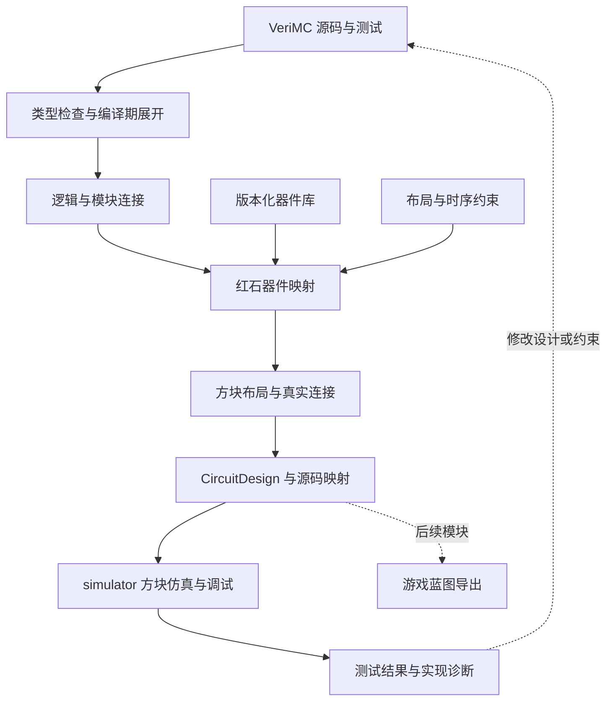

# VeriMC 语言：主要设计思路

**版本：v0.1 · 2026-09-06 · 待用户审阅，尚未批准为语言规范。**

本轮交付主要设计方向，不冻结关键字、运算符、文件格式或完整语法，不开始编译器实现。文中类型名称和示意代码用于讨论；所有编译、映射、布局与验证能力均为提议，不能视为已经实现。

## 1. 核心建议

把 VeriMC 设计成一门 **能够生成真实 Minecraft 红石电路的硬件描述语言**。用户描述模块的输入、输出、组合逻辑和状态变化；工具把它们映射成红石器件，安排方块与连接，再交给 simulator 检查实际行为。

语言提供两个可组合的入口：

- **逻辑描述**：写加法器、计数器、寄存器、状态机及模块连接，主要关心“电路做什么”。
- **结构描述**：实例化已有红石组件，指定端口、方向、位置和连接，必要时精确控制方块结构，主要关心“电路怎么搭”。

布局和时序约束附着在模块及其连接上。一般逻辑可以自动实现；经过手工优化或依赖特殊更新机制的组件可以固定结构，由逻辑模块调用。

建议采用独立文本语言、显式类型、花括号分块和精简的 HDL 概念。编译器建议使用 C++20，以便与当前项目的维护方式一致；这是本子项目的技术建议，尚未把 simulator 的 C++ 选择扩大为用户已经批准的编译器决定。

首个可用版本的目标是：**写出小型组合/同步电路，生成完整方块布局，在 simulator 中验证并从波形定位回源码。** 不把大型 CPU、任意红石机器自动综合或全局最优布局作为首版前提。

## 2. 用户工作流与项目边界

预期使用流程：

1. 编写模块及测试，或复用器件库中的模块。
2. 先检查类型、端口连接和逻辑功能，发现位宽、复位和状态转移错误。
3. 选择固定的 Minecraft 26.2 目标配置与器件库，给出空间和时序要求。
4. 编译生成真实方块、端口映射、初始化步骤和实现报告。
5. 在 simulator 中打开生成的电路，运行相同测试，查看波形与源代码位置。
6. 调整逻辑、组件选择或布局约束后重新编译。未来由独立导出器生成游戏蓝图。



职责约定：

| 部分 | 负责什么 | 对接方式 |
|---|---|---|
| `verimc/` | 语言、编译检查、逻辑模型、器件映射、布局布线、源码定位 | 输出版本化设计与元数据 |
| `simulator/` | 方块机制、游戏时间、状态与事件、三维显示、探针和运行记录 | 接收方块设计；核心不解释 HDL |
| 未来导出模块 | 把可实装设计转换为目标蓝图格式 | 读取 Minecraft ID、状态、坐标和实体数据 |

语言前端可以独立推进；某类电路的物理交付必须等待 simulator 对所需机制的支持与验证。不能因为编译器能产生方块 ID，就宣称电路已经可运行或兼容原版。

## 3. 为什么同时保留逻辑和结构两层

| 路线 | 优点 | 代价 | 建议 |
|---|---|---|---|
| 只描述方块和坐标 | 容易对接现有手工电路，结构控制直接 | 用户仍需逐个安排门和连线，写运算电路繁琐 | 作为结构层能力 |
| 只写高级逻辑，全自动生成 | 编写计数器、运算器方便 | 红石实现、布线和时序困难集中在后端，难表达特殊器件 | 保留逻辑入口，限制首版可综合范围 |
| 逻辑模块 + 结构组件 + 实现约束 | 两种设计可复用，能逐步增加自动化 | 需要清晰的模块边界与验证约定 | **推荐主路线** |

例如，一个八位计数器的计数规则可以用逻辑描述；它的寄存器可以指定使用某个已验证的红石组件；整个计数器可以被限制在某个空间区域。用户无需为每个内部方块写坐标，但可以替换关键组件。

结构组件可以封装比较器、容器、活塞或依赖更新顺序的布局。未建立可靠行为模型的组件仍可作为结构使用，不能直接参加高级逻辑优化，也不能以虚构逻辑模型通过功能验证。

**边界必须明确：** 编译器可以在逻辑层选择等价实现；进入受保护的方块组件后，只执行组件明确允许的变换。固定结构的内部导线、更新过程、朝向和初始化历史不随意重写。

## 4. 语言表达什么

### 4.1 模块、连接和状态是核心概念

建议优先设计：

- 模块与有方向、有类型的端口，模块实例及连接。
- 位、定宽整数、总线及静态大小数组，位选择与拼接。
- 无状态的组合表达式，以及显式保存状态的寄存器。
- 明确的时钟、复位、使能和下一状态计算。
- 编译期常量、模块参数和有限展开，用一份设计生成不同位宽的硬件。
- 组件库引用、实现选择、端口绑定和空间约束。
- 单独的测试描述：输入时间线、期望结果、断言和探针。

每个实例代表一份硬件；实例不会因为“调用结束”而消失。模块中的组合连接同时存在，文本先后不代表执行先后。无状态辅助函数可以表示可展开的计算，不能藏入共享可变状态。

硬件条件表达的是选择路径；编译期条件决定是否生成某段硬件。有限循环可在编译期展开，不能让用户误以为一个加法器会自动按软件循环反复执行。若需要用同一器件多周期完成计算，应显式设计状态机与寄存器。

### 4.2 信号类型要体现红石特点

下列名称只是候选，用于确定类型边界：

| 概念 | 含义 | 关键约束 |
|---|---|---|
| `bit` | 一个逻辑位 | 物理接口约定高低电平及可接受的稳定窗口 |
| `bits<N>` / `uint<N>` / `int<N>` | N 位向量、无符号数、有符号数 | 位宽、位序、扩展、截断和溢出必须有明确规则 |
| `level` | 一个 0–15 红石强度值 | 与四位总线是不同类型，算术范围与转换另行规定 |
| 时钟端口 | 接收已声明协议的时钟信号 | 记录有效边沿、周期要求和脉宽要求 |
| 编译期参数 | 位宽、重复数、坐标或配置 | 编译时确定，不占运行时电路资源 |

四根二进制信号线能表达十六个组合，一条强度线也有十六个取值，但其连接、运算和传输方式不同。二者转换应通过明确的编码/解码组件；不能靠类型转换凭空获得硬件。

强度转逻辑位也应声明检测规则并有对应实现。信号在哪个方块、哪个面输出，测量弱输出、强输出还是接收功率，由物理端口约定，不由一个布尔值代替。

建议位宽不匹配、有符号/无符号混用和数值缩窄默认报错；需要回绕计数或截断时显式表达意图。具体表达式结果位宽与运算符规则留到下一轮完整语义设计。

建议逻辑核心采用二值模型；未复位、无驱动、无效采样、缺少行为模型属于显式诊断或验证状态，不能默认为 0。暂不引入完整的 Verilog 四态与三态总线规则。

### 4.3 状态必须显式，避免含糊的赋值规则

组合输出的所有路径都应有定义；不完整赋值不自动推断锁存器。一个逻辑信号默认只有一个驱动源，多源选择应通过明确的选择器或有定义的结构组件。

同步逻辑在一次有效采样中读取旧状态，计算各寄存器的下一状态，再按逻辑模型共同提交。寄存器未被使能时保持原值。条件优先级、复位优先级与重复写入冲突在语义规范中明确，不能依靠代码排列猜测。

“复位后为零”必须有对应复位电路及输入流程；“开始运行就写成零”只能是明确标注的测试初始化条件。不能把模拟器中强行改状态当作游戏里可实现的复位。

## 5. 建议的代码风格

采用独立语言，有自己的解析器和诊断；借鉴 HDL 的模块、信号和寄存器概念，使用直观的花括号与类型标注。首版不承诺兼容 Verilog/SystemVerilog，不把用户源文件当作 C++ 或 Python 执行。

下面是**表达意图的伪代码**，并非已经确定的 VeriMC 语法：

```text
module Counter(width = 4) {
    input clk: clock
    input reset: bit
    input enable: bit
    output count: uint<width>

    register value: uint<width>

    on rising(clk) {
        next(value) = reset ? 0
                    : enable ? incrementModulo(value)
                    : value
    }

    connect count <- value
}
```

这里表达的是一组持续存在的硬件：寄存器、加一逻辑、选择逻辑和连接。`width` 决定生成多少位，`incrementModulo` 明确表达定宽回绕；它们的最终拼写待后续设计。

另附实现配置，可要求“选用某组寄存器组件、放在指定区域、满足指定时钟周期”。这种配置改变实现选择，不能改变计数规则或暗中增加一个时钟周期的延迟。具体 gt 数值必须来自所用组件与布线的验证结果，本轮不虚构时钟频率。

## 6. 最关键的设计：逻辑正确与红石时序正确分开检查

### 6.1 逻辑模型用于表达功能

组合模型表达输入稳定后应得到的值；同步模型表达满足时钟和输入协议时，每次采样如何改变状态。它方便检查真值表、位宽、状态机和寄存器更新规则。

这个模型不声称红石线路瞬时稳定，也不等价于某种实际器件的逐事件行为。逻辑测试通过只能报告逻辑层的结果。

### 6.2 方块模型决定实际运行结果

完成映射和布局后，真实的 gt 延迟、刻内更新顺序、短脉冲、强弱供电和初始化行为由 simulator 执行。内部事件序号用于定位差异，不能当作可以任意指定的物理时间单位。

高级逻辑必须给出可检查的物理实现条件，包括输入稳定窗口、输出何时可采样、最小脉宽、负载和复位流程。源码中的一次时钟边沿需要映射到具体端口的到达和采样约定，不能假定所有寄存器在同一 gt 内天然同时采样。

建议首版采用**单一时钟域、显式复位、稳定电平接口**。时钟树、数据路径、建立/保持条件以及脉冲传播必须一起检查；不能只看组合路径的最大延迟。达不到周期要求就报告无法实现或给出可行建议，不静默插入流水级。

测试中的理想时钟发生器和输入驱动器可以用于刺激物理输入端口，但需要标注为外部测试设备。可实装设计必须绑定实际时钟/输入组件，或明确列出由外部真实电路承担的接口条件。

### 6.3 两层怎样对应

每个可综合组件至少需要“功能约定 + 物理端口 + 时序限制 + 初始化方法 + 适用环境”。只有在输入符合这些条件时，才比较实际电路在约定采样窗口中的输出与逻辑模型。

**真值表相同不足以证明可以替换。** 同步采样之间的短暂变化仍可能触发时钟端口、活塞或其他边沿敏感组件；允许优化的区域必须证明这些变化不会破坏其接口约定。依赖刻内脉冲和更新顺序的组件优先保持结构，不进入普通布尔优化。

逻辑环默认报错；经过显式封装的锁存器、振荡器等有状态或反馈结构走组件约定和方块验证。首版不提供“任意反馈自动综合”。

缺少时序上界或验证覆盖时，报告“物理时序未验证”。有限测试通过只证明对应场景通过，不等同于所有输入、位置和历史均已证明正确。

## 7. 编译路线：先可靠映射，再逐步扩大自动化

建议将编译过程分成可单独检查的中间表示；“中间表示”就是每个阶段保存的结构化电路数据。

| 阶段 | 主要内容 | 应当发现的问题 |
|---|---|---|
| 解析、类型检查与展开 | 模块、表达式、端口、参数，展开后的有限硬件规模 | 未定义名称、类型/位宽冲突、递归实例化、超出展开预算 |
| 逻辑表示 | 组合运算、状态、控制条件和模块连接 | 多驱动、未连接输入、组合环、无复位依据的状态使用 |
| 器件表示 | 每个逻辑部件对应的红石组件及引脚 | 无可用实现、协议不匹配、未经验证的能力需求 |
| 物理表示 | 方块坐标、方向、端口落点、路由和隔离空间 | 方块冲突、意外耦合、支撑缺失、时序约束失败 |
| 设计输出 | `CircuitDesign`、初始化、版本清单、源码映射与报告 | 不受支持的设计格式、丢失必需元数据、缺少环境声明 |

首版建议使用小型、可读的自有表示及 C++ 数据结构，不把 LLVM/MLIR、Yosys 或大型综合框架设为必需依赖。未来是否复用成熟优化器，依据实际需求和可验证的语义边界决定。

先以“经过验证的组件 + 规则化排列 + 预留布线通道”形成闭环。自动布线限制在已支持的端口、方向、导线路径和规模内；失败时指出未连通的网络、约束与位置，不能把一条抽象连接当成已经铺好的红石线。

之后再增加组合逻辑优化、组件选择和布局搜索。优化目标建议按“满足行为与时序约束 → 降低体积与材料 → 改善可读性”排序，并允许用户选择偏好。报告实际方块数、包围盒、材料和可支持的时序；不宣称全局最优。

编译结果应可复现：固定源文件、配置、编译器版本、库版本和搜索种子，生成相同的规范化设计。编译和搜索都设规模及时间预算，超额明确失败或返回标注为不完整的诊断结果。

## 8. 红石组件库与布局规则

组件库是把语言落到 Minecraft 的关键资产。一个组件建议携带：

| 信息 | 内容 |
|---|---|
| 身份与目标 | 库版本、内容校验值、Java 26.2 规则配置、所需 simulator 能力 |
| 功能 | 类型化端口、组合/状态行为、合法输入协议，或者明确“无逻辑模型” |
| 物理结构 | Minecraft 方块 ID 与属性、方块实体数据、相对坐标、原点 |
| 引脚 | 坐标、面、输入/输出方式、位序、强度范围和负载条件 |
| 空间约定 | 支撑方块、占用区、禁止放置区、布线接入区域及运动预留区 |
| 时序与初始化 | 延迟范围、最小脉宽、采样条件、复位/放置步骤及适用历史 |
| 变换限制 | 可用方向、允许的旋转/镜像，位置与区块环境限制 |
| 证据 | 器件测试、目标游戏差分场景、通过与未覆盖的条件 |

模块之间不能只检查方块是否重叠；还要检查邻近供电、红石连接、支撑面、运动空间和其他所用器件的交互。经过验证的隔离规则仅在对应库和环境中有效，不假设一个固定间距能隔绝所有红石机制。

红石信号不是无损抽象连线。路由必须考虑强度保持、方向、扇出、延迟及相邻干扰；中继或隔离结构都是实际方块，并计入时序和材料成本。

旋转、镜像和平移后的结构不自动继承原组件的兼容结论。库需要记录允许变换及证据；最终组合在实际位置重新运行测试。对位置敏感组件可限制放置条件，不能简单盖上“可旋转”的标签。

手工搭建的优秀电路以后可以封装成库组件。首版先支持明确的组件定义与引用；从任意三维选区自动推断功能、反向还原 HDL，留到以后评估。

## 9. 与 simulator 的数据接口

依据已有总设计第 9.2 节，建议以 `CircuitDesign` 为语义边界。这里指约定中的设计模型，不表示当前已经存在稳定的同名 C++ 类或完整交换格式。

本轮查看到 simulator 正在形成 `verimc.simulator`、`formatVersion: 1` 的 JSON 工程读写，包含方块、规则配置、探针和部分器件数据。它仍是进行中的实现；本语言方案不把临时字段直接冻结为跨子项目规范，也不把当前文件读写能力当作总设计全部要求已完成。

建议通过薄适配层对接，并共同确定以下数据：

- 设计格式版本、目标游戏构建与规则、编译器和器件库版本。
- 真实方块名称、状态属性、坐标、实体数据及区域原点；禁止持久化依赖进程的内部状态编号。
- 模块实例路径、逻辑端口和位索引到方块位置/面的映射。
- 源文件及内容校验值、源代码范围、实例身份到生成器件/方块的映射；优化后一对多或多对一关系应可追踪。
- 明确的初始化策略、必要放置历史、复位流程和外部环境需求。
- 必需能力及验证状态；消费者缺少必需能力或不能保存关键元数据时拒绝接入，不静默降级。

编译器正常输出设计，不制造带未决事件队列的运行快照。需要精确快照的测试由 simulator 在受控初始化后生成，并绑定对应引擎版本。

仿真探针和虚拟刺激属于元数据。编译成功、逻辑测试通过、方块测试通过、目标游戏差分通过应分别报告，并附测试条件与覆盖范围。

建议保留 `.verimc` 作为现有设计工程的暂定扩展名，语言源文件使用独立扩展名（候选 `.vmc`），避免源代码和工程容器混淆。扩展名下一轮一起确定。

手工修改生成布局后，应保留为设计副本或更新结构组件/布局约束。首版不承诺任意方块编辑都能自动同步回 HDL；源码映射失效时应明确显示。

## 10. 建议的首版范围与验收

| 范围 | 建议处理 |
|---|---|
| 模块、参数、定宽信号、组合逻辑、寄存器 | 语言核心；先完整定义有限子集 |
| 单时钟、显式复位、使能、有限状态机 | 首版同步设计范围 |
| 基础门、选择器、加法器、寄存器组件 | 优先建立物理映射；每种实现单独验证 |
| 结构组件、端口、方向、区域与固定位置 | 首版可控实现入口 |
| `level` 端口与结构组件连接 | 类型边界首版明确；自动模拟量综合后续逐项增加 |
| 自动布局布线 | 首版限定组件库、规则化布局和规模，不承诺任意三维路由 |
| 小型 ROM、存储器与复杂运算 | 后续扩展；先明确容量、端口、延迟和成本再支持 |
| 多时钟、异步自动综合、动态结构自动综合 | 后续专题；已有结构组件仍按其能力声明处理 |
| Verilog 导入、完整兼容、反向生成源码 | 非首版要求 |
| 游戏蓝图导出 | 独立后续模块，当前保留数据边界 |

建议按下列顺序验收，每阶段都以实际物理器件支持为前提：

1. **组合闭环**：一个四位加法器从源码生成完整布局，穷举输入并在约定稳定条件下核对和及进位；具备从失败输出定位回源码的路径。
2. **时序闭环**：一个四位计数器验证复位、使能、保持、回绕和时钟协议；既检查逻辑状态，也检查方块波形与违规输入的诊断。
3. **复用闭环**：组合已验证模块形成小型运算部件；替换一个组件或调整布局后重新进行时序和方块验证，验证源码映射与版本记录仍然正确。

以上电路规模是建议的验收用例，不是当前容量或性能成果。目标游戏差分必须使用固定 26.2 构建和同一初始化、放置历史及输入时间线；验收记录区分功能、时序、方块机制和环境覆盖。

实现顺序建议：先完成语言规范与正反例，再完成前端和逻辑检查，再建立组件映射与物理闭环，最后扩大优化和布线能力。不能长期停留在“能解析代码、能画逻辑图”而把它称作红石编译器完成。

## 11. 主要风险与设计取舍

| 风险 | 处理方向 |
|---|---|
| 逻辑仿真通过，真实红石因瞬态或采样顺序失败 | 明确协议与采样条件；组件验证、最终方块验证、原版差分分层进行 |
| 布线和时序比语法实现更难 | 小型已验证组件库起步，先做规则化布局和限定路由 |
| 所谓通用组件依赖位置、方向、负载或初始化 | 把限制纳入库数据，并在最终位置检查 |
| 自动优化改变周期数、窄脉冲或结构行为 | 高级逻辑优化与受保护结构分界；不隐式流水化，不越过验证边界 |
| simulator 与语言同时开发，格式不断变化 | 先约定语义边界，通过版本化适配层接入，不复制仿真规则 |
| 语言越做越像通用软件语言，增加不可综合语义 | 保持硬件核心有限明确；测试操作与可综合硬件分开 |

设计参考采用一手技术文档：Amaranth 将组合逻辑、同步逻辑与编译期展开分别描述；这为本方案区分硬件状态和生成过程提供参考。[Amaranth 0.5.1 Language guide](https://amaranth-lang.org/docs/amaranth/v0.5.1/guide.html)

Yosys 的技术映射说明展示了从通用单元映射到目标单元的过程；CIRCT 的 HW 表示提供模块、实例及端口等结构概念。本方案借鉴这些分层方法，红石组件、空间交互和更新语义仍需本项目单独定义与验证，并不直接继承它们的正确性保证。[Yosys 0.55 Technology mapping](https://yosyshq.readthedocs.io/projects/yosys/en/v0.55/using_yosys/synthesis/techmap_synth.html)、[CIRCT HW dialect](https://circt.llvm.org/docs/Dialects/HW/)

## 12. 本轮请用户拍板的方向

建议把以下内容作为一个整体方案审阅；具体关键字和标点留到下一轮。

| 决定 | 推荐方向 | 主要影响 |
|---|---|---|
| 语言定位 | 面向实际红石硬件的独立 HDL | 支持模块、状态和连接，目标是产生真实方块设计 |
| 抽象层次 | 逻辑描述 + 结构组件 + 实现约束 | 既能写计算逻辑，也能复用手工红石结构 |
| 表达风格 | 显式类型、花括号、精简 HDL 概念 | 便于阅读和诊断，不追求现有语言完整兼容 |
| 首版计算模型 | 组合逻辑与单时钟同步逻辑 | 降低自动映射和时序验证的复杂度 |
| 物理实现路线 | 已验证组件库、规则化布局、限定自动布线 | 先保证完整可运行电路，再扩大规模和优化 |
| 工具实现 | 建议 C++20，独立前端，通过设计模型接入 simulator | 便于维护，核心不依赖浏览器或正在运行的游戏 |

**拍板后下一轮交付：** 完整的词法与语法草案、类型和运算规则、模块/参数/实例规则、组合与时序语义、结构与约束表达、测试语言边界、库组织及版本规则、错误诊断规范，以及加法器、计数器和组件复用的成套正反例。该轮先交付可审阅的语言规范；编译器实现安排另行说明。

## 13. 目录与本轮完成状态

```text
verimc/
  README.md
  docs/
    languageDirection.md    本轮主要设计思路
```

未来源码、测试、组件数据、样例和构建配置均在本目录下增加，本轮不创建占位实现。仓库根目录仅更新项目索引和协作边界，既有 simulator 设计和实现继续独立推进。

本轮完成的是方案文档及与现有设计的边界核对，未运行 HDL、未合成电路、未新增 Minecraft 机制验证。需先审阅第 12 节方向，再进行完整语言规范设计。
