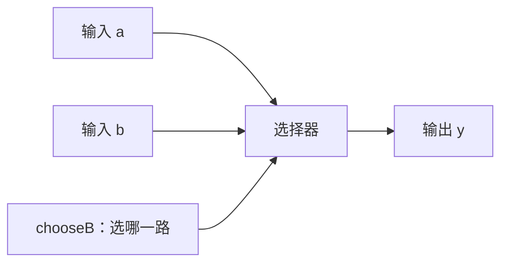
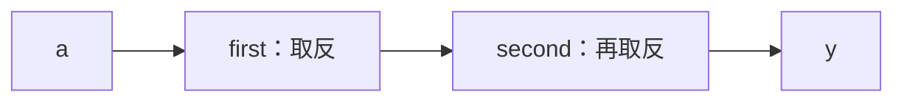

# VeriMC 从零入门：一步步写出一个计数器

面向第一次接触硬件描述语言的读者。依据 VeriMC 0.1 草案，更新于 2026-09-07。

这份教程从“输入和输出是什么”开始。读完后，你应该能看懂一个模块、一个选择器和一个计数器，并为它们写出测试。

**当前 VeriMC 还处于语言设计阶段，编译器尚未实现。** 本教程可以用来读代码、手算结果和准备源文件；文中的结果是依据语言规则推演的预期，不是已经运行出的波形。实际红石方块的传播延迟还需要后续物理实现和 simulator 验证。

## 阅读顺序

- 第 1–3 步：输入、输出、连接、`comb`。先学会描述没有记忆的电路。
- 第 4–5 步：二进制位、数字与参数。读懂你选中的 `width: nat = 4`。
- 第 6–7 步：寄存器、时钟与计数器。学会描述有记忆的电路。
- 第 8–9 步：检查结果、组合已有模块。
- 第 10 步是加法器选读；最后有练习答案和速查表。

不用一口气背下所有语法。每一步先看电路要做什么，再读代码，最后自己预测一次结果。

## 先翻译你选中的两段代码

第一段：

```text
module Counter(width: nat = 4) {
```

读作：**定义一种叫 Counter 的电路模块；它有一个名为 width 的配置项，这个配置项取非负整数，默认是 4。**

在这个计数器中，width 用来决定有多少个二进制位。默认四位，可以表示 0–15。它不表示“计数器从 4 开始”，也不表示“每次加 4”。第 4–5 步会解释为什么。

第二段：

```text
comb {
    if chooseB {
        y = b;
    } else {
        y = a;
    }
}
```

读作：**做一个选择器。chooseB 为真时，输出 y 取 b；chooseB 为假时，输出 y 取 a。**

`comb` 是组合逻辑块。这个块描述的是输出与当前输入之间的关系；它自己不保存“上一次选了什么”。第 3 步会把它画出来。

## 第 1 步：先接通一根线

目标：输入是什么，输出就是什么。

完整文件：[passThrough.vmc](../tutorials/passThrough.vmc)。

```text
language "0.1";
package lessons;

module PassThrough {
    input a: bit;
    output y: bit;

    connect y = a;
}
```

先把它看成一个有入口和出口的小盒子：


逐行读：

| 写法 | 含义 |
|---|---|
| `language "0.1";` | 这个文件按 0.1 版本的语言规则解释 |
| `package lessons;` | 这个文件属于 lessons 这一组代码；入门时照写即可 |
| `module PassThrough { ... }` | 定义一个名叫 PassThrough 的电路模块 |
| `input a: bit;` | 模块有一个输入，名为 a，类型是 bit |
| `output y: bit;` | 模块有一个输出，名为 y，类型也是 bit |
| `connect y = a;` | y 由 a 驱动，持续反映 a 的值 |

这里的 `bit` 表示一个逻辑位，只有两个值：

- `false`：逻辑 0，可用低电平理解。
- `true`：逻辑 1，可用高电平理解。

在实际红石接口里，哪些强度算高、哪些算低，要由组件的接口约定确定。这里先用 0 和 1 理解逻辑关系。

`a`、`y` 和 `PassThrough` 是我们取的名字，可以换成清楚的英文名称。`input`、`output`、`bit`、`connect` 是语言规定的写法。

**冒号 `:` 后面写类型；分号 `;` 结束一条声明或连接；花括号 `{ ... }` 把一个模块的内容包起来。**

这段电路的预期关系是：

| 输入 a | 输出 y |
|---|---|
| false | false |
| true | true |

`connect` 建立的是持续关系。源码中的连线同时存在；它不表示“只在读到这一行时，把 a 复制给 y 一次”。

**练习 1：** a 先为 true，后来变成 false。按这个模块的逻辑关系，y 最后是什么？

## 第 2 步：让输出和输入相反

目标：输入 0 时输出 1，输入 1 时输出 0。这种电路叫反相器。

完整文件：[inverter.vmc](../tutorials/inverter.vmc)。

```text
language "0.1";
package lessons;

module Inverter {
    input a: bit;
    output y: bit;

    connect y = !a;
}
```

与上一步相比，关键变化只有 `!a`。符号 `!` 表示逻辑取反：

| a | `!a`，也就是 y |
|---|---|
| false | true |
| true | false |

先记住这几个用于 bit 的运算即可：

| 表达式 | 含义 |
|---|---|
| `!a` | 把 a 的真假反过来 |
| `a & b` | a 和 b 都为真，结果才为真 |
| `a \| b` | a、b 至少一个为真，结果就为真 |
| `a ^ b` | a、b 不同时为真 |

例如，下面是模块内部的一条连接片段，前提是 a、b、y 都已声明为 bit：

```text
connect y = a & b;
```

它描述“两个条件都满足，输出才为真”。

**练习 2：** 当 a=true、b=false 时，`a & b` 和 `a | b` 分别是什么？

## 第 3 步：理解 comb——根据输入做选择

目标：有两个输入 a、b，另有一个开关 chooseB。开关决定输出取哪一路。

完整文件：[selector.vmc](../tutorials/selector.vmc)。文件后半部分还附有第 8 步会讲的测试。

```text
language "0.1";
package lessons;

module Selector {
    input a: bit;
    input b: bit;
    input chooseB: bit;
    output y: bit;

    comb {
        if chooseB {
            y = b;
        } else {
            y = a;
        }
    }
}
```

它可以画成：



`comb` 来自 combinational，意思是“组合逻辑”。在这个例子里，只要知道现在的 a、b、chooseB，就能确定 y；不需要知道昨天或上一次的输入。

逐句读你选中的那段代码：

1. `comb {`：下面描述一组组合逻辑关系。
2. `if chooseB {`：当 chooseB 为 true 时，采用这一支的输出关系。
3. `y = b;`：这一支让 y 取 b。
4. `else {`：当 chooseB 为 false 时，采用另一支。
5. `y = a;`：另一支让 y 取 a。

可以先把 if/else 理解成选择器的两种接法。两路输入都属于这份电路，控制信号决定哪路影响输出。

| a | b | chooseB | y | 原因 |
|---|---|---|---|---|
| true | false | false | true | 选择 a |
| true | false | true | false | 选择 b |
| false | true | false | false | 选择 a |
| false | true | true | true | 选择 b |

### 为什么这里必须写 else？

下面这段是**错误示例片段**：

```text
comb {
    if chooseB {
        y = b;
    }
}
```

chooseB 为 false 时，代码没有说明 y 应该是什么。VeriMC 会要求你补全这种情况。

“没有写就保持上一次的 y”需要记忆能力；comb 本身不保存历史。第 6 步会用寄存器来明确表达记忆。

简单连接用 `connect` 很直接；根据条件选择输出时，用 comb 的 if/else 容易读。**同一个输出不要既写一条 connect，又在 comb 里赋值，否则会出现重复驱动。**

**练习 3：** a=true、b=false、chooseB=false，y 为 true。现在只把 b 改成 true，选择开关不动。按稳定后的逻辑关系，y 会变吗？

## 第 4 步：一个 bit 怎样变成一个数字

一个 bit 只有 0、1 两种取值。如果要表示 0、1、2、3……，就需要多个二进制位。

看四位二进制数：

| 二进制写法 | 十进制数值 |
|---|---|
| 0000 | 0 |
| 0001 | 1 |
| 0010 | 2 |
| 0011 | 3 |
| 0100 | 4 |
| 1000 | 8 |
| 1111 | 15 |

从右到左四个位的权重是 1、2、4、8。比如 `1001` 就是 8+1=9。

四位共有 2⁴=16 种组合，能表示 0–15。八位有 2⁸=256 种组合，能表示 0–255。

VeriMC 用 `uint<4>` 表示“四位无符号整数”，用 `uint<8>` 表示“八位无符号整数”。无符号表示只表达非负数。

下面是端口声明片段：

```text
output count: uint<4>;
```

读作：**有一个叫 count 的输出，它表示一个四位无符号数。** 这里的 4 是位数，count 的当前数值则可能是 0–15 中的某个数。

写常量时，使用 `u(位数, 数值)`：

| 写法 | 含义 |
|---|---|
| `u(4, 0)` | 四位无符号数 0 |
| `u(4, 1)` | 四位无符号数 1 |
| `u(4, 9)` | 四位无符号数 9，二进制为 1001 |
| `u(8, 9)` | 八位无符号数 9，二进制为 00001001 |

最后两项的数值相同，但宽度不同。语言要求连接时把宽度说清楚，避免在接线时不小心丢位。

`u(4, 16)` 是错误的，因为四位放不下数值 16。

### 四位总线和红石强度有什么区别？

`uint<4>` 的逻辑信息由四个二进制位组成；`level` 表示一条 0–15 的红石强度通道。虽然两者都能表达十六种值，但它们需要不同的传输和处理电路。

本教程的计数器使用四位二进制数据。以后若要把数字编码为一条强度线，需要明确的编码组件，不能直接把两种类型接起来。

## 第 5 步：逐字读懂 width: nat = 4

现在回到第一处让你困惑的代码：

```text
module Counter(width: nat = 4) {
```

这是模块定义的开头片段：

| 部分 | 读法 |
|---|---|
| `module` | 我要定义一种电路模块 |
| `Counter` | 模块名叫 Counter，由我们命名 |
| `( ... )` | 括号里列出制作这类电路时的配置参数 |
| `width` | 一个参数名，意为位宽 |
| `: nat` | 这个参数的类型是自然数：0、1、2、3…… |
| `= 4` | 使用模块时没有另行指定，就采用默认值 4 |
| `{` | 开始写模块里面的端口、连接和状态规则 |

`width` 这个名字本身没有特殊魔法。它会在模块内部被引用，例如：

```text
output count: uint<width>;
```

当 width=4 时，这一项就是 `uint<4>`；当 width=8 时，就是 `uint<8>`。

模块内的这一行限制可接受的配置：

```text
require width >= 1;
```

nat 本身允许 0，但这个电路至少要有一位，所以这里明确拒绝 width=0。

### 配置参数和输入信号有什么区别？

| 名称 | 什么时候确定 | 影响什么 |
|---|---|---|
| `width` 参数 | 生成这份电路之前 | 这份计数器要有多少位 |
| `enable` 输入 | 电路运行时可以改变 | 当前是否允许计数 |
| `reset` 输入 | 电路运行时可以改变 | 当前是否要求复位 |

改变 width 意味着重新生成不同宽度的电路。拨动 enable 则是在操作已经存在的那份电路。

在另一个模块内部，下面的**实例声明片段**表示使用 Counter：

```text
inst small: Counter;
inst wide: Counter(width = 8);
```

`small` 是一份采用默认四位配置的计数器；`wide` 是另一份八位计数器。`inst` 表示创建一份实例，也就是让外层电路包含一份这个模块。

这里只展示了声明，完整电路还必须给它们的输入接线。第 9 步会从更简单的反相器学接线。

**练习 4：** 上面 small、wide 分别能计数到多少？省略 `width = ...` 会不会让位宽变成未知？

## 第 6 步：让电路记住一个值

前面的电路根据当前输入给出结果。现在增加一个需求：**收到一次明确的更新信号时，记下输入；之后输入改变，记下的值仍然保留。**

保存这个值的部件叫寄存器，VeriMC 用 `reg` 声明它。

### 先理解时钟和上升沿

这里的“时钟”是一根专门约定更新节奏的信号线，名称通常写成 `clk`。

信号从低变高，也就是从 0 变成 1 的那次变化，叫**上升沿**。`rising(clk)` 指的就是这个变化。

| clk 的变化 | 是上升沿吗？ |
|---|---|
| 0 → 1 | 是，发生一次 |
| 1 → 1，持续为高 | 否 |
| 1 → 0 | 否，这是下降沿 |
| 0 → 0，持续为低 | 否 |

因此，时钟一直保持高电平，不代表寄存器会一直重复更新。

### 写一个只保存一位的模块

完整文件：[oneBitMemory.vmc](../tutorials/oneBitMemory.vmc)。

```text
language "0.1";
package lessons;

module OneBitMemory {
    input clk: clock;
    input reset: bit;
    input dataIn: bit;
    output dataOut: bit;

    reg saved: bit reset false;

    on rising(clk) reset(reset) {
        next saved = dataIn;
    }

    connect dataOut = saved;
}
```

新的关键行逐个读：

| 写法 | 含义 |
|---|---|
| `input clk: clock;` | 接入时钟信号；clock 是专用类型 |
| `reg saved: bit reset false;` | 保存一个 bit，命名为 saved，规定复位值是 false |
| `on rising(clk) reset(reset)` | 在 clk 上升沿检查复位，再决定状态怎样更新 |
| `next saved = dataIn;` | 若此次没有复位，把当前 dataIn 作为 saved 的下一值 |
| `connect dataOut = saved;` | 把保存的值接到输出上 |

`reset(reset)` 中，括号外的 reset 是语言关键字；括号内的 reset 是我们声明的输入信号名。如果把那个输入改名为 clear，这里就应写 `reset(clear)`。

在这个模块中，每个上升沿按以下规则处理：

1. reset 为 true：saved 变成它声明的复位值 false。
2. reset 为 false：saved 变成该边沿采样的 dataIn。

**这里采用同步复位：仅把 reset 变成 true，还要等到上升沿才复位。** 声明 `reset false` 也不表示刚创建时就自动有了 false；建立初始值需要完成复位过程。

### 跟着表格走一次

下面是按逻辑规则手算的过程。dataOut 始终反映 saved。

| 操作 | reset | dataIn | saved / dataOut |
|---|---|---|---|
| 刚创建，还没有上升沿 | true | false | 尚未复位，不能假定为 false |
| 送来第一个上升沿 | true | false | false，完成复位 |
| 取消复位，把 dataIn 改为 true；没有新边沿 | false | true | 仍为 false |
| 送来第二个上升沿 | false | true | true，记下新输入 |
| 把 dataIn 改为 false；没有新边沿 | false | false | 仍为 true |
| 送来第三个上升沿 | false | false | false，记下新输入 |

这就是“记忆”的意义：两次更新之间，输入可以变化，寄存器仍保存自己的状态。

### next 为什么要单独写？

`next` 明确区分“现在保存的值”和“这次边沿之后要保存的值”。

多个寄存器更新时，右边读取旧状态，然后共同提交下一状态。例如下面是时钟块内部片段，假设 left、right 是同类型寄存器：

```text
next left = right;
next right = left;
```

如果旧值是 left=1、right=2，新值就是 left=2、right=1。第二行仍然读取旧的 left。

**练习 5：** saved 已经是 true。现在 dataIn=false，但 clk 一直维持高电平，没有再次出现 0→1。saved 会改变吗？

## 第 7 步：把记忆和加一组合成计数器

目标：复位后从 0 开始；enable 为 true 时，每个上升沿加一；enable 为 false 时保持。

完整文件：[counter.vmc](../tutorials/counter.vmc)。后面带有第 8 步的练习测试。

```text
language "0.1";
package lessons;

module Counter(width: nat = 4) {
    require width >= 1;

    input clk: clock;
    input reset: bit;
    input enable: bit;
    output count: uint<width>;

    reg value: uint<width> reset u(width, 0);

    on rising(clk) reset(reset) {
        if enable {
            next value = wrapAdd(value, u(width, 1));
        }
    }

    connect count = value;
}
```

读这份代码时，把它分成四件事：

1. **做多宽：** width 默认为 4，因此默认保存四位数字。
2. **外面怎么控制：** clk 提供更新边沿，reset 要求复位，enable 决定是否计数。
3. **里面记什么：** value 保存当前计数，复位值为 `u(width, 0)`。
4. **怎样更新和输出：** 没有复位且 enable 为真时加一；count 持续显示 value。

### 为什么使用 wrapAdd？

`wrapAdd` 可以读成“允许回绕的加法”。两个参数是要相加的值：

```text
wrapAdd(value, u(width, 1))
```

它把当前 value 加上“同样位宽的 1”，结果仍使用原来的位宽。

对于四位计数器：

| 旧 value | 加一后的新 value |
|---|---|
| 0 | 1 |
| 1 | 2 |
| 14 | 15 |
| 15 | 0 |

15 再加一得到二进制 10000，需要五位。四位回绕计数只保留低四位，于是成为 0000。

VeriMC 的普通 `+` 会保留进位，让结果扩宽。两个四位无符号数相加得到五位结果，所以不能直接把 `value + u(4, 1)` 接回四位寄存器。写 wrapAdd 就是在明确告诉工具：这里需要回绕计数。

### 这里的 if 为什么可以没有 else？

在时钟块里，寄存器已有明确的保存能力。**没有给某个 reg 写 next 的分支，表示保留旧值。**

因此，这里的 `if enable` 为 false 时，value 保持。

| 出现的位置 | 没给目标赋值时 |
|---|---|
| comb 中的输出 y | 没有定义当前输出，必须补齐分支 |
| 时钟块中的寄存器 value | 保持旧状态 |

这两个规则分别对应“没有记忆的组合关系”和“明确保存状态的寄存器”。

### 复位和使能谁优先？

每个上升沿按这张表判断：

| reset | enable | 新 value |
|---|---|---|
| true | false | 0 |
| true | true | 0 |
| false | false | 保持旧值 |
| false | true | 旧值加一，按位宽回绕 |

复位优先于块里的普通更新，所以 reset、enable 同时为 true 时，结果仍是 0。

**练习 6：** value 已经是 3。接下来三个上升沿的 `(reset, enable)` 分别是 `(false, true)`、`(false, false)`、`(true, true)`。每次边沿之后 value 是多少？

## 第 8 步：写测试，检查你的理解

你已经会描述电路。接下来描述“给它什么输入，我期待看到什么结果”。

测试中的操作按顺序安排。`drive` 准备一批输入，`sample` 或 `cycle` 提交这批输入，`expect` 检查结果。

### 8.1 先测试选择器

下面的测试追加在第 3 步 Selector 模块的后面。它已经包含在 [selector.vmc](../tutorials/selector.vmc) 中；追加时不用再写一遍 language/package 头。

```text
test selectorPractice for Selector mode logical {
    drive a = true;
    drive b = false;
    drive chooseB = false;
    sample;
    expect y == true;

    drive chooseB = true;
    sample;
    expect y == false;
}
```

逐步读：

1. `test selectorPractice`：测试名叫 selectorPractice。
2. `for Selector`：测试对象是 Selector 模块。
3. `mode logical`：根据逻辑规则检查功能。
4. 三条 drive：准备 a=true、b=false、chooseB=false。
5. `sample;`：把准备好的输入交给组合模型，求当前输出。
6. `expect y == true;`：要求 y 等于 true，否则测试失败。
7. 改成选择 b，再 sample，要求 y 等于 false。

后半段没有重新写 a、b，它们会保持上一次输入的值。

`==` 是“检查是否相等”。它和连接中的 `=` 用途不同：`connect y = a;` 在定义电路，`expect y == true;` 在检查电路结果。

### 8.2 再测试计数器

有寄存器的电路需要时钟边沿。使用 `cycle clk;`，让逻辑测试完成一次含上升沿的时钟周期。

下面的测试已经包含在 [counter.vmc](../tutorials/counter.vmc) 的末尾：

```text
test counterPractice for Counter(width = 4) mode logical {
    drive reset = true;
    drive enable = true;
    cycle clk;
    expect count == u(4, 0);

    drive reset = false;
    cycle clk;
    expect count == u(4, 1);

    drive enable = false;
    repeat 3 { cycle clk; }
    expect count == u(4, 1);

    drive enable = true;
    repeat 14 { cycle clk; }
    expect count == u(4, 15);

    cycle clk;
    expect count == u(4, 0);
}
```

这段测试依次检查五件事：

| 测试阶段 | 预期计数 | 检查什么 |
|---|---|---|
| reset、enable 都为 true，来一次周期 | 0 | 复位优先 |
| 取消复位，再来一次周期 | 1 | 能够加一 |
| 关闭使能，来三次周期 | 1 | 能够保持 |
| 开启使能，再来十四次周期 | 15 | 能够连续计数 |
| 再来一次周期 | 0 | 四位回绕 |

`repeat 14` 在测试里表示对同一份电路重复操作十四次，不会制造十四份计数器。

逻辑测试里的 `cycle` 不等于“一个 Minecraft 游戏刻”。它用来检查一次状态转移；真实周期需要多长、输入何时稳定，要在物理实现时指定并验证。

### 8.3 一个常见错误

以下是错误测试片段：

```text
drive chooseB = true;
expect y == false;
```

输入还在等待提交，这时就检查输出，会产生“输入未提交”的诊断。组合测试要在中间加 sample；计数器测试则根据需要使用 cycle。

目前还没有可运行这些 test 的 VeriMC 执行器。学习时先遮住 expect 后面的值，自己算一遍，再对照预期；不要把文法检查当作电路已经运行通过。

## 第 9 步：把两个已有模块连接起来

你已经有第 2 步的 Inverter。现在让输入经过两次取反：



目标逻辑很简单：0 取反两次回到 0，1 取反两次回到 1。

完整文件：[doubleInverter.vmc](../tutorials/doubleInverter.vmc)。它和 [inverter.vmc](../tutorials/inverter.vmc) 放在同一目录。

```text
language "0.1";
package lessons;
import "inverter.vmc" as gates;

module DoubleInverter {
    input a: bit;
    output y: bit;

    inst first: gates::Inverter;
    inst second: gates::Inverter;

    connect first.a = a;
    connect second.a = first.y;
    connect y = second.y;
}
```

这里有三类名称：

| 名称 | 是什么 |
|---|---|
| `Inverter` | 一种模块的定义 |
| `first`、`second` | 外层电路包含的两份模块实例 |
| `first.a`、`first.y` | first 这份实例的输入、输出 |

`import "inverter.vmc" as gates;` 引入另一个文件，并给它一个简短别名 gates。`gates::Inverter` 表示“那个文件里定义的 Inverter”。

三条连接的方向分别是：

1. 外层输入 a → first 的输入 a。
2. first 的输出 y → second 的输入 a。
3. second 的输出 y → 外层输出 y。

记法是：**`connect 左边目标 = 右边来源;`**

first 和 second 在源码中是两份实例；三个连接同时构成电路。最终方块结构还要经过允许范围内的逻辑优化与物理映射，这张图表示当前描述的逻辑结构。

更大的电路也这样组合：计数器的输出可以接入加法器，多个小模块一起组成控制器或运算部件。你可以先把每个小模块的输入、输出和行为讲清楚，再在外层连接它们。

## 第 10 步：选读——用一个加法器认识 wire 和取位

如果前面的计数器已经读懂，可以继续看这一小步。目标是把两个四位数相加，同时保留进位信息。

完整文件：[adder.vmc](../tutorials/adder.vmc)。

```text
language "0.1";
package lessons;

module Adder4 {
    input a: uint<4>;
    input b: uint<4>;
    output sum: uint<4>;
    output carry: bit;

    wire total: uint<5>;

    connect total = a + b;
    connect sum = asUint(total[0:4]);
    connect carry = total[4];
}
```

`wire total: uint<5>;` 给一个中间信号取名 total。它表示完整的五位加法结果，方便后面的连接引用。

**wire 不保存历史。** 输入改变后，它对应的组合结果也随之改变；reg 则通过明确的更新规则保存状态。

先算一组输入：9+8=17。17 的五位二进制是 10001。

| 位索引 | 4 | 3 | 2 | 1 | 0 |
|---|---|---|---|---|---|
| total 的各位 | 1 | 0 | 0 | 0 | 1 |

接下来两行把结果拆开：

- `total[0:4]` 取索引 0、1、2、3，**不包含 4**，得到低四位 0001。
- `asUint(...)` 把取出的位向量解释为无符号整数，所以 sum=1。
- `total[4]` 取最高位，所以 carry=true。

sum 和 carry 合起来仍然表达 17：1×16+1=17。这里的 sum 是低四位结果，不是完整结果被错误算成了 1。

如果只想输出完整数值，也可以把输出声明成 `uint<5>`，直接连接 `a + b`。实际接口采用哪种形式，取决于使用这个模块的外层电路需要什么。

## 第 11 步：这些代码怎样变成真正的红石？

到这里，你学到的是电路的逻辑描述：端口是什么、结果怎么算、状态什么时候更新。

未来完整的使用流程会是：

1. 用 VeriMC 源码描述电路，并先检查逻辑功能。
2. 选择有版本和验证证据的红石组件库。
3. 把运算、选择器、寄存器等映射到实际组件，安排方块和接线。
4. 检查空间限制、信号强度、脉宽和传播时间。
5. 把方块设计交给 simulator，检查实际波形与时序。

例如，源码里写 `next value = ...`，表达的是保存下一状态的要求；实际用哪些红石方块实现保存，需要后端完成。`clock` 端口也没有偷偷生成一个 Minecraft 时钟机器，仍需接入明确的时钟来源。

逻辑测试中的一次 cycle 方便检查“下一次计数是不是正确”；实际 Minecraft 电路要在输入和时钟条件满足时才能可靠完成这次计数。因此逻辑结果正确之后，还要继续检查方块实现。

这一阶段的目标是先把“电路应做什么”写清楚。你掌握本教程后，再看[物理实现规范](physicalSpec.md)，里面的端口、布局和时序约束就更容易理解。

## 第 12 步：自己练一次，再看答案

建议按这个顺序复习：

1. 只看 Selector 的端口，自己画出两路数据和一个选择开关。
2. 遮住 Counter 的代码，先用中文写下“复位、保持、加一”三条规则。
3. 再把这三条规则对应到 `reg ... reset ...`、`on rising(...)` 和 `if enable`。
4. 在 counterPractice 中把连续计数十四次改为十二次，自己推算该处 expect 应改成多少。

第四项的答案是 13：测试先计到 1，关闭使能时保持 1，重新使能后再增加 12 次，得到 13。随后的最后一次 cycle 会得到 14，相应断言也要改；它就不再覆盖回绕场景了。

### 前面六道练习的答案

| 练习 | 答案与原因 |
|---|---|
| 1 | y=false；PassThrough 的输出持续反映 a |
| 2 | `a & b` 为 false；`a \| b` 为 true |
| 3 | y 仍为 true；chooseB=false 时选择 a，a 没变 |
| 4 | small 到 15，wide 到 255；省略参数使用默认四位 |
| 5 | saved 仍为 true；一直保持高电平不会产生新的上升沿 |
| 6 | 依次是 4、4、0；分别对应加一、保持、复位 |

## 最后留一张速查表

| 看到它时 | 可以先这样读 |
|---|---|
| `module Name { ... }` | 定义一种电路模块 |
| `input a: bit;` | 一根输入逻辑信号 |
| `output n: uint<4>;` | 输出一个四位无符号数 |
| `width: nat = 4` | 制作电路时的位宽参数，默认四位 |
| `connect y = a;` | 把 a 的值接给 y |
| `comb { ... }` | 用当前输入决定输出，不在块内保存历史 |
| `wire t: uint<5>;` | 给五位中间信号取一个名字 |
| `reg v: uint<4> reset u(4, 0);` | 保存四位状态，规定复位值为零 |
| `on rising(clk) reset(reset)` | 在上升沿检查复位并更新寄存器 |
| `next v = ...;` | 指定这次更新后 v 应保存什么 |
| `u(4, 1)` | 四位无符号常量 1 |
| `wrapAdd(v, u(4, 1))` | 四位加一，超出后回绕 |
| `inst unit: SomeModule;` | 在外层电路里放一份模块实例 |
| `drive` / `sample` / `cycle` / `expect` | 准备输入 / 组合采样 / 时钟周期 / 检查结果 |

需要精确查询时再读[语言规范](languageSpec.md)；想继续练习模块组合和状态机，可读[成套示例](../examples/README.md)。教程的七个完整源文件集中在[入门示例目录说明](../tutorials/README.md)。
